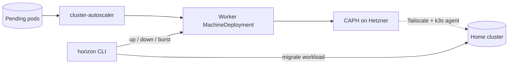

# horizon

[](https://github.com/lucawalz/horizon/actions/workflows/ci.yaml)
[](LICENSE)


An on-demand homelab node scaler: a Cluster-API operator CLI that adds capacity to an existing cluster by scaling node pools.

## Description

horizon is a thin command-line operator over Cluster API. It gives a small Kubernetes cluster elastic headroom without owning any cloud provisioning itself. When a workload needs more room than the local nodes provide, horizon scales an existing worker pool so new nodes join the cluster, and it can migrate a workload onto those nodes and tear the pool back down afterward.

The substrate horizon operates over lives in the companion [bedrock](https://github.com/lucawalz/bedrock) repository: Cluster API with the Hetzner provider (CAPH) for infrastructure and cluster-api-k3s for bootstrap and control planes, managed by Rancher Turtles, with Tailscale for connectivity and an in-cluster cluster-autoscaler for scale-on-demand. horizon reads and writes Cluster API objects through a kubeconfig context and leaves the definition of infrastructure to bedrock.

### Pool categories

horizon distinguishes two capacity categories, each with a different owner.

- Elastic pools (`horizon.dev/pool-type=elastic`): autoscaled by the in-cluster cluster-autoscaler, which scales them to zero and back as pending pods demand. horizon can scale an elastic pool by hand, but the autoscaler owns the pool and may override that scale.
- Reserved pools (`horizon.dev/pool-type=reserved`): operator-pinned and kept off the autoscaler's min and max annotations. horizon owns these through its scale, drain-down, and burst actions; this is the default pool type. Reserved pools carry a Flux create-once annotation, so a manual scale sticks.

The scale and burst actions target a pool type, defaulting to the configured `default_type` (`reserved`). Each type maps to a MachineDeployment name through the `pools.types` config. Pool machines join the existing home cluster, whose control plane is externally managed, so Cluster API never marks it initialized on its own; an in-cluster ExternalControlPlane controller latches that status so workers bootstrap.

### Background

horizon exists so a three-node home cluster can absorb occasional heavy jobs without running extra hardware year-round. bedrock declares the permanent cluster and the CAPI substrate; horizon adds and removes temporary capacity on top of it.

## Architecture

The in-cluster cluster-autoscaler watches for pending pods and scales the autoscaler-managed pools on its own, so routine scale-out needs no laptop. horizon adds explicit control on top through its dashboard: it scales a worker pool up or down and runs a guided burst. A burst takes a Velero backup of the target namespace, scales the worker pool up, waits for the new machines to become ready, rewrites workload node affinity onto the pool, and waits for the workload to land on the new nodes.

Nodes are labeled `horizon.dev/pool=<value>` at join time by bedrock's KThreesConfigTemplate. horizon never labels nodes itself; it rewrites workload affinity to target that label. Durable pools can be rendered into the bedrock git tree for Flux to reconcile. horizon writes the tree but never commits or pushes it.



## Requirements

horizon is provider-agnostic at the operations layer. It reads and writes Cluster API objects through a kubeconfig and holds no cloud credentials, so the same binary scales pools over any infrastructure provider that Cluster API supports. The provider-specific definition stays with the substrate in bedrock, so a second cloud is a substrate change rather than a horizon change. The homelab substrate in [bedrock](https://github.com/lucawalz/bedrock) is one concrete instance, not a hard dependency.

### Running horizon on any cluster

The minimum substrate falls into a hard set that horizon always needs and an optional set that gates individual features.

Hard requirements:

- A Kubernetes management cluster and a kubeconfig with a context that reaches it.
- Cluster API core installed, providing the Cluster, MachineDeployment, and Machine CRDs.
- At least one infrastructure provider installed and configured. Cloud credentials and machine templates live in the provider's namespace, managed by Cluster API, never by horizon.
- MachineDeployments labeled `horizon.dev/pool-type=<type>` so horizon recognizes them as pools, with `pools.types` mapping each type to its MachineDeployment name and `pools.namespace` pointing at the namespace where those MachineDeployments live.

Optional, each gating one feature:

- metrics-server for the dashboard CPU and memory header.
- cluster-autoscaler for the autoscaler status line and elastic-pool scaling.
- Velero for backups, restores, schedules, and the burst workflow.

horizon never calls a cloud API and stores no cloud credentials. The infrastructure provider does all cloud work through Cluster API; horizon only manipulates Cluster API objects.

### Minimal configuration

A minimal `config.yaml` names the kubeconfig, the target cluster, and the pool layout. The theme is optional.

```yaml
kubeconfig: ""
cluster: burst
theme: auto

pools:
  namespace: caph-system
  default_type: reserved
  types:
    reserved: reserved-workers
```

Set `pools.namespace` to the namespace where the chosen provider's MachineDeployments live. The full template is in [`config.example.yaml`](config.example.yaml).

## Installation

Homebrew is the recommended path once a release is published:

```
brew install lucawalz/tap/horizon
```

Building from source needs Go 1.26 or newer:

```
go build -o horizon ./cmd/horizon
```

Or install it into the Go bin directory:

```
go install github.com/lucawalz/horizon/cmd/horizon@latest
```

`make install` builds and installs the binary into `~/.local/bin`, re-signing it on macOS. Override the destination with `PREFIX`, and remove it with `make uninstall`.

### First run

`horizon init` launches a guided setup that detects the kubeconfig context, queries the cluster to prefill the pool layout, and writes `config.yaml` to the configured path. Running `horizon` with no configuration offers the same setup before opening the dashboard. Prefill needs the cluster reachable; the chosen context is recorded so later runs reuse it.

## Usage

Configuration is read from `$HORIZON_CONFIG_DIR/config.yaml`, then `$XDG_CONFIG_HOME/horizon/config.yaml`, falling back to `~/.config/horizon/config.yaml`.

Running `horizon` with no subcommand launches the interactive command centre, a Bubble Tea dashboard that both observes the cluster and drives every action. Two launch flags scope it: `--context` selects the kubeconfig context, and `--cluster` selects the target CAPI cluster.

```
horizon
horizon --context homelab --cluster burst
```

### The dashboard

The command centre opens on a split view. A banner names the active context and cluster, a pressure header shows cluster CPU and memory with fixed usage bands and the count of pending pods, and panels on the left list the nodes and the pools with their type and replica state. A command log fills the right, recording each command and its output. The dashboard refreshes on its own as long as it is open, so the figures track the cluster without a manual reload.

The pool panel shows the type read from each MachineDeployment's `horizon.dev/pool-type` label, alongside its desired and ready replicas and machine state. The pressure header warns when the externally managed control plane is not yet marked initialized, so an uninitialized control plane is not silently missed.

### Actions

The dashboard is driven by a command line. Pressing `:` focuses a prompt at the bottom and the output streams into the command log on the right. The dashboard refreshes when a command changes cluster state. Destructive commands ask for confirmation first, and long operations such as a burst stream their progress.

The available commands are:

- `up [--type elastic|reserved] [<replicas>]` and `down [--type ...] [--delete]` scale a pool up or to zero, or delete it.
- `burst <namespace> [--type ...] [--replicas n]` backs up a workload, scales the pool, and migrates the workload onto the new nodes.
- `backup create [--include-namespaces ...] [--wait]`, `backup list`, `backup describe <name>`, and `backup delete <name>` drive Velero backups.
- `restore create --from-backup <name> [--wait]`, `restore list`, and `restore describe <name>` drive Velero restores.
- `schedule create <name> --schedule "<cron>" [--include-namespaces ...]`, `schedule list`, `schedule describe <name>`, and `schedule delete <name>` manage recurring backup schedules.
- `bsl create <name> --provider <p> --bucket <b>` registers a backup storage location CR without provisioning the bucket, and `bsl list` inspects them.
- `drain <node>` cordons a node and evicts its pods.
- `theme [light|dark|auto]` sets the theme directly, or opens a live picker with no argument. The choice persists to the config file.

Any command accepts a trailing `--debug` flag. It streams a curated step trace of the action alongside the raw Kubernetes API calls into the command log, dimmed and prefixed for separation, and pauses the periodic refresh for the duration so the trace stays focused on the action. The flag is per-command and off by default.

Navigation is keyboard-only; the mouse was removed so native terminal text selection works as usual. Outside the command line the arrow keys and pgup/pgdn scroll the log, `r` refreshes, `?` toggles help, and `q` quits. Type `help` at the prompt for the full list of commands.

### Non-interactive use

The dashboard is the primary interface; two subcommands run outside it. `horizon version` prints the build version and exits, and `horizon init` runs the setup wizard.

## Configuration

The config file sets the kubeconfig, the `repo_path` GitOps work tree used for writes, and the default pool target. A template is in [`config.example.yaml`](config.example.yaml).

Key fields:

- `kubeconfig`: path to the kubeconfig; empty uses the default loading rules.
- `context`: target kubeconfig context; the `--context` flag overrides it, and the setup wizard records the chosen context here.
- `cluster`: default CAPI cluster name; falls back to the pool cluster when unset.
- `repo_path`: path to the GitOps git work tree, required only for the GitOps write action. It is resolved to an absolute path and must exist.
- `theme`: dashboard theme, one of `auto`, `light`, or `dark`; the `:theme` picker writes this field. Defaults to `auto`.
- `pools`: the default `namespace` and `cluster` (`burst`), the `default_type` (`reserved`), the Kubernetes `version` applied to rendered pools, and a `types` map from pool type to MachineDeployment name (`reserved` to `reserved-workers`). Set `namespace` to the namespace where the chosen provider's MachineDeployments live; it defaults to `caph-system` for the bedrock setup.

The retired `infra_path` and `bedrock_path` fields are both rejected at load time; set `repo_path` instead.

## Releases

Pushing a `v*` tag triggers the GoReleaser workflow, which builds the darwin and linux binaries, publishes a GitHub release, and updates the Homebrew formula in the tap.

The tap requires a one-time operator setup that cannot be automated from this repository:

1. Create a public `lucawalz/homebrew-tap` repository to hold the generated formula.
2. Add a `HOMEBREW_TAP_GITHUB_TOKEN` repository secret to this repository, holding a personal access token with `contents:write` on the tap.

## How it works

- Routine scale-out is the cluster-autoscaler's job. The autoscaler owns elastic pools and scales them to zero on its own. horizon owns reserved pools, scaling them directly, and deliberately leaves the autoscaler min and max annotations off them so the two scaling paths do not fight.
- A burst rolls back on failure: a failed migration restores the saved affinity and a failed scale returns the pool to its prior replica count.
- The control-plane status is latched by an in-cluster ExternalControlPlane controller, not by horizon. horizon only reads it, and the dashboard warns when it is unset.
- Workload placement is a contract: bedrock's KThreesConfigTemplate labels nodes `horizon.dev/pool=<type>` at join, and horizon rewrites workload affinity to match the targeted pool type.

## Repository layout

```
cmd/horizon/        main entry point
internal/tui/       Bubble Tea command centre and panels
internal/core/      presentation-free query surface and action functions
internal/config/    configuration loading and schema
internal/capi/      Cluster API client, pool operations, manifest rendering, git writes
internal/controller/  ExternalControlPlane controller that latches externally-managed control-plane status
internal/k8s/       cluster client, drain, workload migration
internal/prometheus/  pressure queries over a port-forward
internal/velero/    backups and restores
docs/adr/           architecture decision records
```

## Contributing

Contributions are welcome. See [CONTRIBUTING.md](CONTRIBUTING.md) for the build, test, branch, and commit conventions. In short: `go build ./...`, `go test ./...`, then open a PR against `main`; CI runs the same checks.

## Support

Open an issue on the [GitHub repository](https://github.com/lucawalz/horizon/issues).

## Authors and acknowledgment

Built and maintained by Luca Walz. It builds on cobra, viper, controller-runtime, client-go, the Cluster API libraries, Velero, and the Prometheus client libraries.

## License

Released under the MIT License. See [LICENSE](LICENSE).

## Project status

Actively developed alongside the bedrock homelab.
