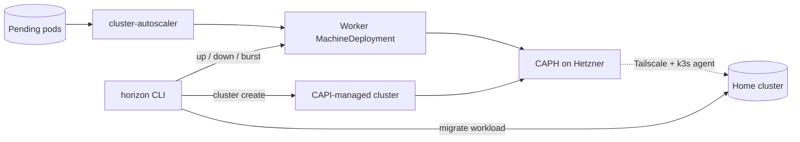

# horizon

[](https://github.com/lucawalz/horizon/actions/workflows/ci.yaml)
[](LICENSE)


A Cluster-API operator CLI: it adds on-demand capacity to a homelab cluster by scaling node pools and standing up clusters.

## Description

horizon is a thin command-line operator over Cluster API. It gives a small Kubernetes cluster elastic headroom without owning any cloud provisioning itself. When a workload needs more room than the local nodes provide, horizon scales an existing worker pool so new nodes join the cluster, and it can migrate a workload onto those nodes and tear the pool back down afterward. It can also stand up a separate, fully managed cluster on demand.

The substrate horizon operates over lives in the companion [bedrock](https://github.com/lucawalz/bedrock) repository: Cluster API with the Hetzner provider (CAPH) for infrastructure and cluster-api-k3s for bootstrap and control planes, managed by Rancher Turtles, with Tailscale for connectivity and an in-cluster cluster-autoscaler for scale-on-demand. horizon reads and writes Cluster API objects through a kubeconfig context and leaves the definition of infrastructure to bedrock.

### Pool categories

horizon distinguishes three capacity categories, each with a different owner.

- Elastic pools (`horizon.dev/pool-type=elastic`): autoscaled by the in-cluster cluster-autoscaler, which scales them to zero and back as pending pods demand. horizon can scale an elastic pool by hand with `up --type elastic`, but the autoscaler owns the pool and may override that scale.
- Reserved pools (`horizon.dev/pool-type=reserved`): operator-pinned and kept off the autoscaler's min and max annotations. horizon owns these through `up`, `down`, and `burst`; this is the default `--type`. Reserved pools carry a Flux create-once annotation, so a manual scale sticks.
- Clusters (`cluster create`, `delete`, `list`): separate CAPI-managed clusters with their own KThreesControlPlane that auto-import to Rancher. No nudge applies.

The `up`, `down`, and `burst` commands take a `--type` flag that selects the pool type to target; it defaults to the configured `default_type` (`reserved`). Each type maps to a MachineDeployment name through the `pools.types` config. Pool machines join the existing home cluster, whose control plane is externally managed, so Cluster API never marks it initialized on its own; a one-time nudge latches that status so workers bootstrap.

### Background

horizon exists so a three-node home cluster can absorb occasional heavy jobs without running extra hardware year-round. bedrock declares the permanent cluster and the CAPI substrate; horizon adds and removes temporary capacity on top of it.

## Architecture

The in-cluster cluster-autoscaler watches for pending pods and scales the autoscaler-managed pools on its own, so routine scale-out needs no laptop. horizon adds explicit control on top: it scales a worker pool up or down, runs a guided burst, and manages on-demand clusters. A burst takes a Velero backup of the target namespace, scales the worker pool up, waits for the new machines to become ready, rewrites workload node affinity onto the pool, and waits for the workload to land on the new nodes.

Nodes are labeled `horizon.dev/pool=<value>` at join time by bedrock's KThreesConfigTemplate. horizon never labels nodes itself; it rewrites workload affinity to target that label. Durable pools and clusters can be rendered into the bedrock git tree for Flux to reconcile. horizon writes the tree but never commits or pushes it.



## Requirements

- Go 1.26 or newer to build.
- A reachable Kubernetes cluster with the CAPI substrate from bedrock installed: CAPH, cluster-api-k3s, and Rancher Turtles.
- A kubeconfig with a context that reaches the management cluster, over Tailscale in the homelab setup.
- Velero in the cluster for backups, and kube-prometheus-stack for the read-only pressure header in `status`.

## Installation

```
go build -o horizon ./cmd/horizon
```

Or install it into the Go bin directory:

```
go install github.com/lucawalz/horizon/cmd/horizon@latest
```

## Usage

Configuration is read from `$HORIZON_CONFIG_DIR/config.yaml`, or `~/.config/horizon/config.yaml` by default. The persistent `--context` flag selects the kubeconfig context, `--cluster` selects the target CAPI cluster, and `--dry-run` prints planned actions without making changes.

Show cluster pressure, pools, machines, the nudge state, and autoscaler activity:

```
$ horizon status
CPU: 0.08/0.80 ●  Mem: 0.16/0.80 ●  Pending pods: 0

NAME       ROLE     CPU%   MEM%   PODS   STATUS   IP
master     master   13%    17%    26     Ready    10.20.0.10
worker-1   worker   6%     8%     16     Ready    10.20.0.11
worker-2   worker   4%     23%    27     Ready    10.20.0.12

POOL              TYPE       DESIRED   READY   MACHINE   PHASE   NODE   PROVIDER-ID
reserved-workers  reserved   0         0       -         -       -      -
elastic-workers   elastic    0         0       -         -       -      -

Clusters
(no managed clusters)

control-plane: initialized
autoscaler: Health: Healthy
```

The pool table shows the `TYPE` column read from each MachineDeployment's `horizon.dev/pool-type` label, and a `Clusters` section lists any separate CAPI-managed clusters.

Scale the reserved pool up to add nodes. When the externally-managed control plane is not yet marked initialized, rerun with `--nudge` to latch it:

```
horizon up --nudge
```

Target the elastic pool instead with `--type`; the autoscaler still owns it:

```
horizon up --type elastic
```

Scale the reserved pool back to zero, or remove it entirely:

```
horizon down
horizon down --delete
```

Burst a namespace onto the reserved pool, backing up, scaling, waiting, and migrating the workload:

```
horizon burst --workload <namespace>
```

Create, list, and delete on-demand CAPI-managed clusters:

```
horizon cluster create --name <name>
horizon cluster list
horizon cluster delete --name <name>
```

Render manifests instead of applying live, for GitOps durability:

```
horizon cluster create --name <name> --dry-run   # print to stdout
horizon cluster create --name <name> --write      # write into the bedrock tree
```

Manage Velero backups and restores, and drain a node:

```
horizon backup create --include-namespaces <namespace> --wait
horizon restore create --from-backup <backup>
horizon drain <node>
```

## Configuration

The config file sets the kubeconfig, the bedrock checkout used for GitOps writes, the default pool target, and the display thresholds. A template is in [`config.example.yaml`](config.example.yaml).

Key fields:

- `kubeconfig`: path to the kubeconfig; empty uses the default loading rules.
- `cluster`: default CAPI cluster name; falls back to the pool cluster when unset.
- `bedrock_path`: path to the bedrock git work tree, required only for `--write` GitOps renders. It is resolved to an absolute path and must exist.
- `pools`: the default `namespace` (`caph-system`) and `cluster` (`burst`), the `default_type` (`reserved`), the Kubernetes `version` used by `cluster create` when `--version` is omitted, and a `types` map from pool type to MachineDeployment name (`elastic` to `elastic-workers`, `reserved` to `reserved-workers`).
- `thresholds`: the `burst` and `scale_down` scores and the `window` size, retained only for the read-only pressure header in `status`. They no longer drive any scaling decision.

The retired `infra_path` field is rejected at load time; set `bedrock_path` instead.

## How it works

- Routine scale-out is the cluster-autoscaler's job. The autoscaler owns elastic pools and scales them to zero on its own. horizon owns reserved pools, scaling them directly, and deliberately leaves the autoscaler min and max annotations off them so the two scaling paths do not fight.
- A burst rolls back on failure: a failed migration restores the saved affinity and a failed scale returns the pool to its prior replica count.
- The control-plane nudge is a status-subresource write, the one deliberate exception to GitOps durability. It cannot live in git and resets if the Cluster is recreated, so `status` warns when it is unset.
- Workload placement is a contract: bedrock's KThreesConfigTemplate labels nodes `horizon.dev/pool=<type>` at join, and horizon rewrites workload affinity to match the targeted pool type.

## Repository layout

```
cmd/horizon/        main entry point
internal/cli/       cobra commands (status, up, down, burst, cluster, backup, restore, drain)
internal/config/    configuration loading and schema
internal/capi/      Cluster API client, pool and cluster operations, manifest rendering, git writes, nudge
internal/k8s/       cluster client, drain, workload migration
internal/prometheus/  pressure queries over a port-forward
internal/velero/    backups and restores
docs/adr/           architecture decision records
```

## Contributing

Contributions are welcome. See [CONTRIBUTING.md](CONTRIBUTING.md) for the build, test, branch, and commit conventions. In short: `go build ./...`, `go test ./...`, then open a PR against `main`; CI runs the same checks.

## Support

Open an issue on the [GitHub repository](https://github.com/lucawalz/horizon/issues).

## Authors and acknowledgment

Built and maintained by Luca Walz. It builds on cobra, viper, controller-runtime, client-go, the Cluster API libraries, Velero, and the Prometheus client libraries.

## License

Released under the MIT License. See [LICENSE](LICENSE).

## Project status

Actively developed alongside the bedrock homelab.
