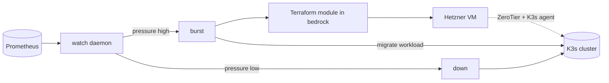

# horizon

[](https://github.com/lucawalz/horizon/actions/workflows/ci.yaml)
[](LICENSE)


A homelab burst orchestrator: it watches a K3s cluster for resource pressure and temporarily extends it onto cloud VMs.

## Description

horizon is a command-line controller that gives a small Kubernetes cluster elastic headroom. It watches the cluster for CPU and memory pressure and, when a workload needs more room than the local nodes can provide, provisions a temporary node on Hetzner Cloud, joins it to the cluster over a ZeroTier overlay, moves the workload onto it, and tears the node down once pressure subsides.

The infrastructure side, the Terraform module and NixOS image for the burst node, lives in the companion [bedrock](https://github.com/lucawalz/bedrock) repository. horizon drives that module through its `infra_path` setting and does not own the cloud definitions itself.

### Features

- Pressure-driven autoscaling with a sliding window and hysteresis, so a brief spike does not trigger a burst.
- A `watch` daemon that scales out and back in on its own, plus manual commands for one-off bursts.
- Workload migration: a Velero backup, node affinity rewritten onto the burst node, and pods evicted so they reschedule there.
- A burst-phase state machine recorded in-cluster, so an interrupted run can be inspected and rolled back.
- A pluggable provider interface, with Hetzner Cloud as the implemented backend.

### Background

horizon exists so a three-node home cluster can absorb occasional heavy jobs without running extra hardware year-round. It is the active half of a pair: bedrock declares the permanent cluster, and horizon adds and removes temporary capacity on top of it.

## Architecture

The watch loop polls Prometheus for cluster pressure. When the score stays above the burst threshold across several consecutive samples, horizon runs a burst: it backs up the target namespace with Velero, applies the bedrock Terraform module to create a Hetzner VM, authorizes that VM on the ZeroTier network, waits for it to register as a K3s node, and migrates the workload onto it. When pressure falls below the scale-down threshold, it drains and destroys the node.



## Requirements

- Go 1.26 or newer to build.
- A reachable Kubernetes/K3s cluster running kube-prometheus-stack (Prometheus and Pushgateway) and Velero.
- The Terraform CLI (1.9 or newer) and a local checkout of the bedrock repository.
- A Hetzner Cloud project and a ZeroTier network, with their API tokens available as environment variables.

## Installation

```
go build -o horizon ./cmd/horizon
```

Or install it into the Go bin directory:

```
go install github.com/lucawalz/horizon/cmd/horizon@latest
```

## Usage

Configuration is read from `$HORIZON_CONFIG_DIR/config.yaml`, or `~/.config/horizon/config.yaml` by default. Every command accepts `--dry-run` to print the planned actions without making changes.

Show cluster pressure and the current burst phase:

```
$ horizon status
CPU: 0.08/0.80 ●  Mem: 0.16/0.80 ●  Pending: 0
BurstPhase: Idle

NAME       ROLE     CPU%   MEM%   PODS   STATUS   IP
master     master   13%    17%    26     Ready    10.0.0.1
worker-1   worker   6%     8%     16     Ready    10.0.0.2
worker-2   worker   4%     23%    27     Ready    10.0.0.3
```

Run the autoscaler in the foreground:

```
horizon watch --workload <namespace>
```

Provision a burst node without moving a workload:

```
horizon up
```

Burst a specific namespace onto a new node:

```
horizon burst --workload <namespace>
```

Tear a burst node down and remove it from the cluster:

```
horizon down
```

Cordon a node and evict its pods, honoring disruption budgets:

```
horizon drain <node>
```

## Configuration

The config file sets the provider, the path to the bedrock Terraform module, the scaling thresholds, and the provider and overlay credentials. Secrets are read from environment variables rather than committed: `HCLOUD_TOKEN`, `ZEROTIER_API_TOKEN`, and the K3s join values. A template is in [`config.example.yaml`](config.example.yaml).

Key fields:

- `infra_path`: path to the bedrock `terraform/hetzner` module that horizon applies.
- `thresholds`: the `burst` and `scale_down` scores, the sliding `window` size, `cooldown_minutes`, and `max_burst_nodes`.
- `hetzner`: `server_type` and `location` for the burst VM.
- `zerotier`: `network_id` and the master's address on the overlay.
- `k3s`: `url`, the master's API endpoint on the ZeroTier network, plus the join token supplied from the environment.

## How it works

- Pressure is the higher of cluster CPU and memory utilization, plus a margin when pods are pending, capped at 1.0.
- The watch daemon keeps a sliding window of samples and requires several consecutive readings over the threshold before bursting, with a cooldown after scaling back in.
- Burst progress is recorded in the `horizon-state` ConfigMap in `kube-system` as a phase (Idle, BackingUp, Provisioning, Joining, Migrating, Running, TearingDown). Per-node state files live under `~/.local/state/horizon/`.

## Repository layout

```
cmd/horizon/          main entry point
internal/cli/         cobra commands (status, up, down, burst, drain, watch)
internal/config/      configuration loading and schema
internal/provider/    provider interface and the Hetzner implementation
internal/k8s/         cluster client, drain, workload migration, phase state
internal/zerotier/    ZeroTier network membership
internal/prometheus/  pressure queries over a port-forward
internal/velero/      pre-burst backups
internal/runner/      sequential step runner with rollback
docs/adr/             architecture decision records
```

## Contributing

Contributions are welcome. See [CONTRIBUTING.md](CONTRIBUTING.md) for the build, test, branch, and commit conventions. In short: `go build ./...`, `go test ./...`, then open a PR against `main`; CI runs the same checks.

## Support

Open an issue on the [GitHub repository](https://github.com/lucawalz/horizon/issues).

## Authors and acknowledgment

Built and maintained by Luca Walz. It builds on cobra, viper, terraform-exec, client-go, controller-runtime, Velero, and the Prometheus client libraries.

## License

Released under the MIT License. See [LICENSE](LICENSE).

## Project status

Actively developed alongside the bedrock homelab.
