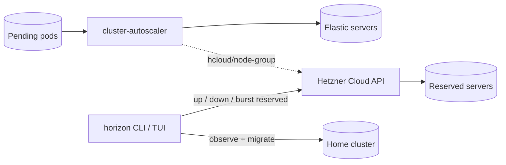

# horizon

[](https://github.com/lucawalz/horizon/actions/workflows/ci.yaml)
[](LICENSE)


An operator CLI and terminal dashboard for adding on-demand reserved capacity to a homelab Kubernetes cluster.

## Description

horizon is a command-line operator and Bubble Tea dashboard for a small Kubernetes cluster. It observes cluster pressure, drives on-demand reserved capacity, and migrates a workload onto that capacity and back. It is optional and never load-bearing: routine scale-out happens without it, and the cluster keeps running when it is closed.

The cluster horizon operates over lives in the companion [bedrock](https://github.com/lucawalz/bedrock) repository: Cluster API with the Hetzner provider (CAPH) for the permanent cluster and cluster-api-k3s for bootstrap and control planes, managed by Rancher Turtles, with Tailscale for connectivity. An in-cluster cluster-autoscaler, configured with the native Hetzner Cloud provider, owns elastic burst capacity. horizon reads cluster state through a kubeconfig context and provisions reserved servers through the Hetzner Cloud API directly. bedrock defines the cluster; horizon adds and removes temporary reserved capacity on top of it.

### What horizon does and does not do

Two scaling paths exist, with two different owners, and they do not overlap.

- Elastic capacity is owned by the in-cluster cluster-autoscaler. The autoscaler watches for pending pods and scales the elastic pool to zero and back on its own, talking to the native Hetzner provider. horizon never provisions or deletes elastic servers; the scale actions refuse the elastic pool type and point back at the autoscaler.
- Reserved capacity is owned by horizon. Reserved servers are operator-pinned: horizon provisions them on demand against the Hetzner Cloud API and removes them when asked. This is the default pool type.

horizon enforces reserved ownership in code. It labels each server it creates `horizon.dev/managed-by=horizon` and `horizon.dev/pool=reserved`, and only ever lists or deletes servers carrying the managed-by label. A server that also carries the autoscaler's `hcloud/node-group` marker is refused outright, so the two scaling paths never fight over the same machine.

### Pool model

horizon recognizes three categories of capacity.

- Elastic: autoscaled by the cluster-autoscaler. Nodes carry `horizon.dev/pool=elastic`. A pod lands on an elastic burst node only when it declares both halves of the contract itself: a `nodeSelector` or required node affinity for `horizon.dev/pool=elastic`, and a toleration for the `horizon.dev/burst=true:NoSchedule` taint that keeps Longhorn off the node and lets the autoscaler drain it back to zero.
- Reserved: operator-pinned through horizon. A reserved server boots from the shared pool-node image and joins the cluster by Hetzner user-data built from the autoscaler's elastic join material, identical to an autoscaler node apart from its pool label. A reserved burst needs no manual workload setup, since horizon's migration rewrites the affinity and adds the burst toleration on each migrated Deployment and StatefulSet.
- The home cluster's permanent nodes, defined entirely in bedrock.

horizon sources the Hetzner API token and the join material at runtime from in-cluster secrets (`hcloud` and `cluster-autoscaler-hcloud-config` by default), so no cloud credentials live in its own config.

## Architecture

The code follows a hexagonal layout: a presentation-free core of queries and actions surrounded by adapters.

- `internal/core` holds the query surface and action functions and depends on no terminal code.
- `internal/tui` renders the Bubble Tea dashboard and translates the command line into core calls.
- `internal/capi` reads Cluster API MachineDeployments for pool-type detection and Flux Kustomization and HelmRelease status.
- `internal/hcloud` provisions, lists, and deletes reserved servers and reads the in-cluster Hetzner secrets.
- `internal/k8s` holds the cluster client, node drain, and workload migration.
- `internal/velero` drives backups, restores, schedules, and storage locations.

A burst composes these adapters: it takes a Velero backup of the target namespace, provisions reserved servers through the Hetzner Cloud API, waits for the new nodes to become ready, rewrites the workload's node affinity onto the reserved pool and adds the burst toleration, and waits for the workload to land. A failed migration restores the saved affinity and a failed scale returns the reserved pool to its prior server count.



## Requirements

horizon reads cluster state through a kubeconfig and provisions reserved servers through the Hetzner Cloud API.

Hard requirements:

- A Kubernetes cluster and a kubeconfig with a context that reaches it.
- For reserved capacity: a Hetzner Cloud token and the autoscaler's elastic join material, read from the in-cluster secrets named in the `reserved` config block. The shared pool-node image must be present in the Hetzner project.

Optional, each gating one feature:

- metrics-server for the dashboard CPU and memory pressure header.
- cluster-autoscaler for the autoscaler status line; its status is read from the `cluster-autoscaler-status` ConfigMap.
- Velero for backups, restores, schedules, and the burst workflow.
- Flux for the GitOps status line.

### Minimal configuration

A minimal `config.yaml` names the kubeconfig and the target cluster. The pool layout and reserved secret coordinates fall back to the bedrock defaults.

```yaml
kubeconfig: ""
cluster: burst
theme: auto

pools:
  namespace: caph-system
  default_type: reserved
  types:
    reserved: reserved-workers
```

The full template is in [`config.example.yaml`](config.example.yaml); the `reserved` block is optional and falls back to the defaults below.

## Installation

Homebrew is the recommended path once a release is published:

```
brew install lucawalz/tap/horizon
```

Building from source needs Go 1.26 or newer:

```
go build -o horizon ./cmd/horizon
```

Or install it into the Go bin directory:

```
go install github.com/lucawalz/horizon/cmd/horizon@latest
```

`make install` builds and installs the binary into `~/.local/bin`, re-signing it on macOS. Override the destination with `PREFIX`, and remove it with `make uninstall`.

### First run

`horizon init` launches a guided setup that detects the kubeconfig context, queries the cluster to prefill the pool layout, and writes `config.yaml` to the configured path. Running `horizon` with no configuration offers the same setup before opening the dashboard. Prefill needs the cluster reachable; the chosen context is recorded so later runs reuse it.

## Usage

Configuration is read from `$HORIZON_CONFIG_DIR/config.yaml`, then `$XDG_CONFIG_HOME/horizon/config.yaml`, falling back to `~/.config/horizon/config.yaml`.

Running `horizon` with no subcommand launches the interactive command centre, a Bubble Tea dashboard that both observes the cluster and drives every action. Two launch flags scope it: `--context` selects the kubeconfig context, and `--cluster` selects the target cluster.

```
horizon
horizon --context homelab --cluster burst
```

Two subcommands run outside the dashboard. `horizon version` prints the build version and exits, and `horizon init` runs the setup wizard.

### The dashboard

The command centre opens on a split view. A banner names the active context and cluster, a pressure header shows cluster CPU and memory with fixed usage bands and the count of pending pods, and panels on the left list the nodes and the pools with their type and replica state. A command log fills the right, recording each command and its output. The dashboard refreshes on its own as long as it is open, so the figures track the cluster without a manual reload.

The pool panel groups nodes by their `horizon.dev/pool` label and, for the reserved pool, overlays the servers horizon has provisioned but not yet joined, alongside desired and ready counts and per-node state.

### Actions

The dashboard is driven by a command line. Pressing `:` focuses a prompt at the bottom and the output streams into the command log on the right. The dashboard refreshes when a command changes cluster state. Destructive commands ask for confirmation first, and long operations such as a burst stream their progress.

The available commands are:

- `up [--type elastic|reserved] [--replicas N] [<replicas>]` scales the reserved pool up to the requested server count, defaulting to one server.
- `down [--type elastic|reserved] [--delete]` scales the reserved pool to zero, removing every server horizon provisioned.
- `burst <namespace> [--type ...] [--replicas n]` backs up the namespace, provisions reserved servers, and migrates the workload onto the new nodes.
- `backup create [--include-namespaces ...] [--ttl ...] [--selector ...] [--storage-location ...] [--snapshot-volumes ...] [--name ...] [--wait]`, `backup list`, `backup describe <name>`, and `backup delete <name>` drive Velero backups.
- `restore create --from-backup <name> [--include-namespaces ...] [--namespace-mappings old:new] [--name ...] [--wait]`, `restore list`, and `restore describe <name>` drive Velero restores.
- `schedule create <name> --schedule "<cron>" [--include-namespaces ...]`, `schedule list`, `schedule describe <name>`, and `schedule delete <name>` manage recurring backup schedules.
- `bsl create <name> --provider <p> --bucket <b> [--prefix ...] [--credential secret/key]` registers a backup storage location against an existing bucket, and `bsl list` inspects them.
- `drain <node>` cordons a node and evicts its pods.
- `theme [light|dark|auto]` sets the theme directly, or opens a live picker with no argument. The choice persists to the config file.

The scale and burst actions target a pool type, defaulting to the configured `default_type` (`reserved`). Passing `--type elastic` returns an error pointing back at the cluster-autoscaler, since horizon does not provision elastic capacity. The `--namespace` and `--pool` flags on `up`, `down`, and `burst` override the resolved MachineDeployment namespace and name.

Any command accepts a trailing `--debug` flag. It streams a curated step trace of the action alongside the raw Kubernetes API calls into the command log, dimmed and prefixed for separation, and pauses the periodic refresh for the duration so the trace stays focused on the action. The flag is per-command and off by default.

Navigation is keyboard-only; the mouse is disabled so native terminal text selection works as usual. Outside the command line the arrow keys and pgup/pgdn scroll the log, `r` refreshes, `?` toggles help, and `q` quits. Type `help` at the prompt for the full list of commands.

## Configuration

The config file sets the kubeconfig, the target cluster, the pool layout, and the reserved server coordinates. A template is in [`config.example.yaml`](config.example.yaml).

Key fields:

- `kubeconfig`: path to the kubeconfig; empty uses the default loading rules.
- `context`: target kubeconfig context; the `--context` flag overrides it, and the setup wizard records the chosen context here.
- `cluster`: default cluster name; falls back to the pool cluster when unset.
- `repo_path`: path to a GitOps git work tree; resolved to an absolute path and required to exist when set.
- `theme`: dashboard theme, one of `auto`, `light`, or `dark`; the `theme` picker writes this field. Defaults to `auto`.
- `pools`: the default `namespace` (`caph-system`), `cluster` (`burst`), `default_type` (`reserved`), the Kubernetes `version` applied to rendered pools, and a `types` map from pool type to MachineDeployment name (`reserved` to `reserved-workers`). Set `namespace` to the namespace where the provider's MachineDeployments live.
- `reserved`: the Hetzner coordinates for reserved provisioning. `token` and `join_config` are secret references (`namespace`, `name`, `key`) defaulting to `hcloud`/`hcloud-token` and `cluster-autoscaler-hcloud-config`/`HCLOUD_CLUSTER_CONFIG` in `kube-system`. `location` (`hel1`), `server_type` (`cpx22`), and `ssh_keys` (`bedrock-capi`) set the server shape. SSH key names are resolved to Hetzner key ids at create time.

The retired `infra_path` and `bedrock_path` fields are both rejected at load time; set `repo_path` instead.

## Releases

Pushing a `v*` tag triggers the GoReleaser workflow, which builds the darwin and linux binaries, publishes a GitHub release, and updates the Homebrew formula in the tap.

The tap requires a one-time operator setup that cannot be automated from this repository:

1. Create a public `lucawalz/homebrew-tap` repository to hold the generated formula.
2. Add a `HOMEBREW_TAP_GITHUB_TOKEN` repository secret to this repository, holding a personal access token with `contents:write` on the tap.

## How it works

- Routine scale-out is the cluster-autoscaler's job. The autoscaler owns elastic capacity and scales it to zero on its own through the native Hetzner provider. horizon owns reserved capacity, provisioning and deleting its servers directly through the Hetzner Cloud API, so the two scaling paths do not fight.
- Reserved ownership is enforced in code: horizon only ever lists or deletes servers carrying `horizon.dev/managed-by=horizon`, and refuses any server that also carries the autoscaler's `hcloud/node-group` marker.
- A burst rolls back on failure: a failed migration restores the saved affinity and a failed scale returns the reserved pool to its prior server count.
- Workload placement is a contract: a pool node labels itself `horizon.dev/pool=<type>` at join, and horizon rewrites workload affinity to match the targeted pool type.

## Repository layout

```
cmd/horizon/        main entry point
internal/cli/       cobra root, version, and init commands
internal/tui/       Bubble Tea command centre, command line, and panels
internal/core/      presentation-free query surface and action functions
internal/config/    configuration loading and schema
internal/capi/      Cluster API client for pool-type detection and Flux status
internal/hcloud/    Hetzner Cloud client for reserved server provisioning
internal/k8s/       cluster client, drain, workload migration
internal/velero/    backups, restores, schedules, storage locations
docs/adr/           architecture decision records
```

## Contributing

Contributions are welcome. See [CONTRIBUTING.md](CONTRIBUTING.md) for the build, test, branch, and commit conventions. In short: `go build ./...`, `go test ./...`, and `golangci-lint run`, then open a PR against `main`; CI runs the same checks.

## Support

Open an issue on the [GitHub repository](https://github.com/lucawalz/horizon/issues).

## Authors and acknowledgment

Built and maintained by Luca Walz. It builds on cobra, viper, Bubble Tea, controller-runtime, client-go, the Cluster API libraries, the Hetzner Cloud SDK, and Velero.

## License

Released under the MIT License. See [LICENSE](LICENSE).

## Project status

Actively developed alongside the bedrock homelab.
</content>
</invoke>
