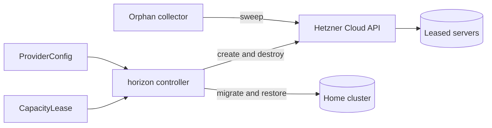

# horizon

[](https://github.com/lucawalz/horizon/actions/workflows/ci.yaml)
[](LICENSE)


Leases on-demand cloud capacity for a Kubernetes cluster and guarantees the capacity is destroyed when the lease expires.

## Description

horizon is a Kubernetes operator. It adds temporary worker capacity to a cluster that already exists, holds it for a bounded period, and takes it away again. A `CapacityLease` states how much capacity, from which provider and region, for how long, and for which workload. The controller provisions against that statement, moves the named workload onto the new nodes, and releases everything once the deadline passes.

Renting capacity is easy. Guaranteeing it goes away is the engineering problem, and that is what the project exists to solve. The value on offer is the promise that nothing is still billing after the deadline, not the provisioning.

The cluster horizon operates over lives in the companion [bedrock](https://github.com/lucawalz/bedrock) repository: three bare-metal nodes running NixOS and K3s, reconciled by Flux v2, with Tailscale carrying connectivity for nodes that are not on the home network. bedrock defines the cluster; horizon adds and removes temporary capacity on top of it. horizon is optional and never load-bearing: routine operation happens without it and the cluster keeps running when it is gone.

## Status

`0.1.0` is the first release. At the time of writing no tag has been pushed, so neither the image nor the chart exists in a registry yet.

Implemented:

- the `CapacityLease` and `ProviderConfig` custom resource definitions, both cluster-scoped
- the lease controller: accept, provision, adopt the joining nodes, migrate the named workload, expire, release
- the orphan collector, which reconciles the provider against the cluster on a timer and deletes what no live lease claims
- the Hetzner Cloud provider behind a narrow instance seam, with an in-memory implementation and a contract suite every implementation must pass
- workload migration onto and off the leased nodes, and node drain
- the Helm chart that installs the controller and the definitions
- the node-side dead man's switch on two clocks: a monotonic backstop and a wall clock deadline seeded from the instance label and renewed through the leased node
- delivery of the node token and the controller version into the cloud-init, and the capability gate that refuses a lease when neither the provider nor the configuration can guarantee teardown
- three commands, `horizon controller`, `horizon watchdog` and `horizon version`

Not implemented:

- the web interface. Nothing is served, the binary has no flag for it, and the chart carries no values, port, or ingress for it.
- the watch command and the lease verbs on the command line. Lease state is read with `kubectl get capacityleases`, which the printer columns make readable.
- `ProviderConfig` status conditions. The subresource exists and stays empty.

Two records set the direction. [ADR 0017](docs/adr/0017-capacity-lease-controller-over-cli-saga.md) moved orchestration out of a command line sequence and into a custom resource reconciled by a controller, because a linear sequence cleans up only if the process survives to clean up and was measured leaking a rented server on every kill. [ADR 0019](docs/adr/0019-replace-terminal-interface-with-web-and-printer-columns.md) removed the terminal interface and the first-run wizard in favour of printer columns, a watch command, and a web interface.

## How teardown is enforced

Teardown is layered, so that no single failure leaves a machine running and billing.

A finalizer is first. `horizon.dev/capacity-lease` is added and persisted in its own reconcile pass, which returns before the provider is ever consulted. No instance can exist without a finalizer already standing between its lease and deletion.

Ownership labels are applied atomically at create. Every instance carries `horizon.dev/managed-by=horizon`, `horizon.dev/pool=reserved`, `horizon.dev/expires-at` as a Unix timestamp, `horizon.dev/lease`, and `horizon.dev/lease-uid`, all passed in the same create call as the machine itself. The deadline is recorded on the lease before the first instance is requested, so an instance that exists always carries the deadline it is meant to die at. The Hetzner implementation lists and deletes only servers carrying the managed-by label, and refuses to create or delete a server that also carries an `hcloud/node-group` marker, so an autoscaler's machine is never touched.

Deletion is confirmed, not assumed. After the provider reports a successful delete the controller reads the instance back and requires a not-found result. Anything else keeps the instance unreleased, the lease unfinished, and the finalizer in place.

An orphan collector reconciles the provider against the cluster. Once a minute it lists every instance carrying the managed-by label across every `ProviderConfig` and deletes any whose owning lease UID no longer resolves to a live lease, either five minutes past the deadline on its own label or immediately if that label cannot be parsed. A second reconciler watches Nodes, and deletes a Node that carries a dead lease UID, reports not ready, and has no matching instance at any configured provider.

The last layer runs on the leased server itself, so it survives the operator, the cluster and the network all being gone. `horizon watchdog` starts with the machine and proves its own identity before arming: it reads the hostname and instance id from the metadata service, reads the instance back from the provider, and refuses to arm unless the provider id matches the metadata. A `terminating` sentinel is written before the first delete, so a restart mid-teardown resumes the teardown instead of arming a fresh lifetime. Retries continue at up to a minute apart for as long as the process lives, because giving up leaves the server billing, and absence is confirmed by reading the instance back exactly as the controller does. The token is read from a file and never from a flag or an environment variable, so it stays out of the process arguments and the unit definition, and the provider client the watchdog builds carries no server specification, so it can delete but never create.

The watchdog runs two clocks and fires on whichever comes first. The backstop is `--max-lifetime`, measured against a monotonic clock from the moment the process arms, so a clock correction cannot defer it and it needs nothing outside the machine. The second clock is a wall clock deadline that is seeded at boot and renewed afterwards. The seed comes from the `horizon.dev/expires-at` label the controller stamps on the instance in the create call, read out of the same provider response that proves the identity, so the deadline the lease asked for is armed before the machine has joined anything and without a second API call. The renewal comes from the cluster: every adopted node carries a `horizon.dev/watchdog-deadline` annotation holding a Unix timestamp, rewritten roughly once per `renewInterval` and never set beyond the lease expiry, so a node cannot outlive the lease that pays for it. The watchdog reads that annotation from its own Node object on every poll, using the kubelet credential already on the machine, which can read its own Node and nothing else. Nothing is pushed to the server and no port is opened on it.

The wall clock holds the most recently known deadline, the seed until a read of the node succeeds and the annotation after that, whether the annotation falls earlier or later than the seed, because renewal is what a lease is for. It may only shorten the life of the machine, never defer it, so no renewal carries a server past its backstop. A partition is treated as death rather than a reason to wait: there is no retry budget and no partition detector, so a failed read leaves the last known deadline standing, the seed included, and that deadline simply elapses. `slack` is the retry budget, and it is the schema that guarantees there is one, because `slack` must exceed `renewInterval`. A server that never joins the cluster still dies on the deadline it was seeded with; only an instance whose expiry label is missing or unreadable runs on the backstop alone, and a seed that has already passed fires on the first poll rather than failing to arm.

Launch and registration have deadlines of their own. An instance that has not launched within five minutes, or that has launched but whose node has not registered within fifteen, is released and the lease marked degraded rather than left waiting.

A lease is refused before it is accepted when neither the provider nor the configuration can guarantee teardown. Hetzner keeps billing a powered-off server and offers no server-side deadline, so it reports that self-termination does not stop billing, and a Hetzner provider config that carries no `nodeCredentialSecretRef` therefore has no way to destroy a machine once the operator is gone. Such a lease is rejected with the reason recorded on its `Accepted` condition, and nothing is created. The check is deliberately confined to acceptance: teardown, expiry and orphan collection build the same provider client and keep working, so capacity that already exists is still released and a configuration change never strands a running server.

The schema bounds the blast radius before any of that runs. `replicas` is capped at 8, `duration` at 8 hours, and `teardownGrace` at 15 minutes, all rejected by the API server rather than by the controller.

Node deletion is guarded in the other direction too. The controller refuses to delete a Node whose `horizon.dev/lease-uid` label does not match the lease doing the deleting, and sends the Node UID as a precondition so a recreated node of the same name is not deleted by mistake.

## Custom resources

Both definitions are cluster-scoped and live in the `horizon.dev/v1alpha1` group.

### CapacityLease

| Field | Required | Description |
| --- | --- | --- |
| `spec.providerRef` | yes | Name of the `ProviderConfig` to provision through. |
| `spec.region` | yes | Provider region, passed through unchanged. A Hetzner location name such as `nbg1`. |
| `spec.size` | yes | Provider machine type, such as `cx22`. |
| `spec.replicas` | yes | Number of instances, between 1 and 8. |
| `spec.duration` | yes | Lifetime measured from acceptance, between `5m` and `8h`. |
| `spec.workload.namespace` | no | Namespace whose Deployments and StatefulSets are moved onto the leased nodes and restored on release. Omit it to add bare capacity. |
| `spec.teardownGrace` | no | Drain timeout per node before the instance is deleted, between `0s` and `15m`. Defaults to `2m`. |

The status carries `phase`, `acceptedAt`, `expiresAt`, `watchdogDeadline` holding the wall clock deadline last written onto the leased nodes, a per-instance list with the provider id, node name and instance phase, the names of the migrated workloads, and conditions. The phase is derived from the conditions and is one of `Pending`, `Provisioning`, `Active`, `Expiring`, `Released`, or `Degraded`. The conditions are `Accepted`, `InstancesReady`, `WorkloadMigrated`, `Expired`, `Released`, and `Degraded`.

Printer columns expose replicas, region, phase, expiry, readiness, and age, so `kubectl get`, k9s, Rancher and Headlamp are all useful without a horizon-specific client. The short name is `cl`.

```yaml
apiVersion: horizon.dev/v1alpha1
kind: CapacityLease
metadata:
  name: batch-run
spec:
  providerRef: hetzner
  region: nbg1
  size: cx22
  replicas: 2
  duration: 2h
  workload:
    namespace: batch
```

### ProviderConfig

| Field | Required | Description |
| --- | --- | --- |
| `spec.type` | yes | Provider type. `hetzner` is the only accepted value. |
| `spec.hetzner.credentialsSecretRef` | yes | Secret name and key holding the Hetzner Cloud API token. |
| `spec.hetzner.cloudInitSecretRef` | yes | Secret name and key holding the cloud-init the instance boots with. It must already apply the `horizon.dev/pool=reserved` node label, and it may carry the sentinels below. |
| `spec.hetzner.imageSelector` | no in the schema | Exactly one label and value selecting the boot image. The provider refuses to build without it, so it is required in practice. |
| `spec.hetzner.sshKeys` | no | Hetzner SSH key names, resolved to key ids at create time. |
| `spec.hetzner.firewalls` | no | Names of existing Hetzner Cloud Firewalls attached to every created server, at most five. The firewalls are never created or reconciled by horizon, and a name that does not resolve fails the create. |
| `spec.hetzner.nodeCredentialSecretRef` | no in the schema | Secret name and key holding the delete-capable Hetzner Cloud API token the watchdog uses to destroy its own server. It is substituted into the cloud-init rather than mounted. Hetzner cannot stop billing by self-terminating, so a lease is refused while this is unset, which makes it required in practice. |
| `spec.watchdog` | yes | `renewInterval`, `slack` and `maxLifetime`, cross-validated against each other. `renewInterval` is how often the controller rewrites the deadline on each leased node, `slack` is how long a node keeps running after the renewals stop, and `maxLifetime` bounds the whole policy. |

```yaml
apiVersion: horizon.dev/v1alpha1
kind: ProviderConfig
metadata:
  name: hetzner
spec:
  type: hetzner
  hetzner:
    credentialsSecretRef:
      name: horizon-hetzner
      key: token
    cloudInitSecretRef:
      name: horizon-cloud-init
      key: cloud-init
    nodeCredentialSecretRef:
      name: horizon-hetzner-node
      key: token
    imageSelector:
      snapshot-name: cluster-node
  watchdog:
    renewInterval: 1m
    slack: 2m
    maxLifetime: 8h
```

### Cloud-init sentinels

The cloud-init is substituted when the provider is built, so the watchdog can install and authenticate itself without anything placed on the machine by hand. Two placeholders are recognised:

| Sentinel | Replaced with |
| --- | --- |
| `${HORIZON_NODE_TOKEN}` | The value behind `spec.hetzner.nodeCredentialSecretRef`. |
| `${HORIZON_VERSION}` | The build stamp of the running controller, so a machine fetches the agent release that matches the operator that provisioned it. |

Substitution is a literal replacement and not a template evaluation, so braces and dollar signs that are not one of these two placeholders pass through untouched, and a cloud-init using neither placeholder is delivered byte for byte. Anything starting `${HORIZON_` still standing afterwards fails the provider build and is named in the error, so a machine never boots with a placeholder where a credential belongs. The `horizon.dev/pool=reserved` check runs on the substituted text.

## Configuration

Configuration is the `ProviderConfig` resource plus the Secrets it points at. There is no configuration file, and the binary reads none.

Secret references are resolved in the namespace the controller runs in, taken from the `POD_NAMESPACE` environment variable and falling back to the service account namespace file projected into the pod. A `ProviderConfig` is cluster-scoped, so the reference carries a name and a key but no namespace.

## Capacity model

Reserved capacity is the only path. An instance is operator-pinned: horizon creates it on demand against the Hetzner Cloud API and deletes it when the lease ends. It boots from the image the selector names and joins the cluster through the cloud-init held in the Secret.

Node placement is a contract. A leased node is labelled `horizon.dev/pool=reserved` along with the lease name and UID, annotated `horizon.dev/watchdog-deadline`, and tainted `horizon.dev/burst=<lease>:NoSchedule` as it joins, so nothing schedules onto it by accident. Labels and the annotation are written with a merge patch scoped to `metadata`, so a renewal cannot collide with the kubelet, and the taint is added under a conflict retry because a taint list cannot be merged safely. When a lease names a workload namespace, horizon rewrites the affinity of each Deployment and StatefulSet in it to target the pool and adds the matching toleration, then restores the original placement during teardown.


```mermaid
flowchart LR
  lease[CapacityLease] --> controller[horizon controller]
  config[ProviderConfig] --> controller
  controller -->|create and destroy| hcloud[Hetzner Cloud API]
  hcloud --> servers[(Leased servers)]
  controller -->|migrate and restore| cluster[(Home cluster)]
  orphan[Orphan collector] -->|sweep| hcloud
```

## Architecture

The controller is built on controller-runtime. The provider is a seam rather than a dependency, so the reconcilers never reach a cloud SDK directly.

- `api/v1alpha1` holds the `CapacityLease` and `ProviderConfig` types and their validation markers.
- `internal/agent` holds the node-side dead man's switch: identity resolution, the deadline rule, the node annotation read, and the destroy loop.
- `internal/controller` holds the lease reconciler, the orphan collector, and the factory that turns a `ProviderConfig` into a provider.
- `internal/manager` wires the manager: scheme, cache, metrics, health probes, leader election, and the reconcilers.
- `internal/provider` declares the instance lifecycle interface, the capability report, and the label constants.
- `internal/provider/hetzner` creates, gets, lists, and deletes Hetzner servers behind that interface.
- `internal/provider/conformance` holds the contract suite every provider implementation must pass.
- `internal/provider/fake` holds the in-memory provider and the create and delete ledger used in tests.
- `internal/k8s` holds workload migration, placement restore, and node drain.
- `internal/cli` holds the cobra root and the three commands.
- `internal/version` holds the build stamp.

## Requirements

Hard requirements:

- A Kubernetes cluster at 1.29 or newer, and permission to install cluster-scoped custom resource definitions and RBAC into it.
- A Hetzner Cloud API token and a cloud-init that joins the cluster and applies the `horizon.dev/pool=reserved` node label, each stored in a Secret in the controller's namespace.
- A delete-capable Hetzner Cloud API token for the leased machines, stored in a Secret in the controller's namespace and named by `nodeCredentialSecretRef`. Hetzner cannot stop billing by self-terminating, so no lease is accepted while that reference is unset.
- A boot image in the Hetzner project, selectable by a single label.

## Installation

The controller is installed from the Helm chart, published as an OCI artifact by a release tag:

```
helm install horizon oci://ghcr.io/lucawalz/charts/horizon \
  --namespace horizon-system --create-namespace
```

No tag has been pushed yet, so that command has nothing to resolve until `v0.1.0` is released. Until then, install from a checkout of the repository:

```
helm install horizon ./charts/horizon --namespace horizon-system --create-namespace
```

The chart templates the controller Deployment, its ServiceAccount, a ClusterRole and binding for the cluster-scoped work, a namespaced Role and binding for leader election and Secret reads, a Service, an optional Ingress, and the two custom resource definitions. See [`charts/horizon/README.md`](charts/horizon/README.md) for every value and for why the definitions live in `crds/` rather than `templates/`.

Building from source needs Go 1.26 or newer:

```
make build
```

`make install` builds and installs the binary into `~/.local/bin`, re-signing it on macOS. Override the destination with `PREFIX`, and remove it with `make uninstall`. The binary is the controller, so it is only useful where it can reach a cluster.

## Command line

```
horizon controller   Run the in-cluster capacity lease controller
horizon watchdog     Enforce the node-side teardown deadline from the leased server itself
horizon version      Print the build stamp
```

`horizon` with no subcommand prints help. `horizon controller` takes three flags:

| Flag | Default | Description |
| --- | --- | --- |
| `--leader-elect` | `true` | Hold a leader election lease so only one replica reconciles. |
| `--metrics-bind-address` | `:8080` | Address the metrics endpoint binds to. |
| `--health-probe-bind-address` | `:8081` | Address the liveness and readiness endpoints bind to. |

`horizon watchdog` runs on the leased server rather than in the cluster, started by the cloud-init that boots it. It takes seven flags:

| Flag | Default | Description |
| --- | --- | --- |
| `--max-lifetime` | none, required | Age at which the server deletes itself, between `5m` and `24h`. |
| `--token-file` | `/etc/horizon/token` | File holding the provider token used to delete this server, written by the cloud-init from the `${HORIZON_NODE_TOKEN}` sentinel. |
| `--kubeconfig` | `/var/lib/rancher/k3s/agent/kubelet.kubeconfig` | Kubelet credential used to read the renewed deadline from this node. A missing file is not an error, and leaves the deadline seeded from the instance label standing. |
| `--node-name` | empty | Server and node to act on. Empty means the hostname reported by the metadata service. |
| `--poll-interval` | `15s` | Interval between deadline checks, and between reads of the node annotation. |
| `--metadata-url` | `http://169.254.169.254/hetzner/v1/metadata` | Base URL of the instance metadata service. |
| `--state-dir` | `/run/horizon` | Directory holding the sentinel that records a teardown in progress. |

## Releases

`charts/horizon/Chart.yaml` is the single source of truth for the released version. Bumping its `version` and `appVersion` is a deliberate commit that precedes the tag, and the workflow refuses to publish anything when the tag does not match the declared chart version.

Pushing a `v*` tag triggers the release workflow, which can also be dispatched manually against an existing tag when a run needs repeating. It builds the linux amd64 and arm64 container image from the repository `Dockerfile` and pushes it to `ghcr.io/lucawalz/horizon`, packages the Helm chart and pushes it to `ghcr.io/lucawalz/charts/horizon`, and only then has GoReleaser build the darwin and linux binaries and publish the GitHub release with the archives attached. The release is created last so that a published release always advertises an image and a chart that exist. See [ADR 0020](docs/adr/0020-chart-yaml-as-the-release-version-source-of-truth.md) for the full contract.

The image is built from source in a `golang` stage and shipped on `gcr.io/distroless/static-debian12:nonroot`, so it carries no shell and no package manager and runs as uid 65532. Both the archive binaries and the image binary are built with `-trimpath` and identical linker flags, so the two are byte-identical for a given platform.

## Repository layout

```
api/v1alpha1/       CapacityLease and ProviderConfig types
cmd/horizon/        main entry point
internal/cli/       cobra root, version command, controller command, watchdog command
internal/agent/     node-side dead man's switch
internal/manager/   controller-runtime wiring
internal/controller/  lease reconciler, orphan collector, provider factory
internal/k8s/       workload migration, placement restore, node drain
internal/provider/  instance lifecycle interface, capabilities, label constants
                    hetzner/ Hetzner Cloud implementation
                    conformance/ contract suite every implementation must pass
                    fake/ in-memory implementation with a create and delete ledger
internal/version/   build stamp
config/crd/bases/   generated custom resource definitions
charts/horizon/     Helm chart for the in-cluster controller
docs/adr/           architecture decision records
```

## Contributing

Contributions are welcome. See [CONTRIBUTING.md](CONTRIBUTING.md) for the build, test, branch, and commit conventions. In short: `go build ./...`, `make test`, which fetches the envtest control plane binaries the controller tests need, and `golangci-lint run`, then open a PR against `main`; CI runs the same checks.

## Security

See [SECURITY.md](SECURITY.md) for the supported versions and how to report a vulnerability.

## Support

Open an issue on the [GitHub repository](https://github.com/lucawalz/horizon/issues).

## Authors and acknowledgment

Built and maintained by Luca Walz. It builds on cobra, controller-runtime, client-go, the kubectl drain libraries, and the Hetzner Cloud SDK.

## License

Released under the MIT License. See [LICENSE](LICENSE).

## Project status

Actively developed alongside the bedrock homelab.
