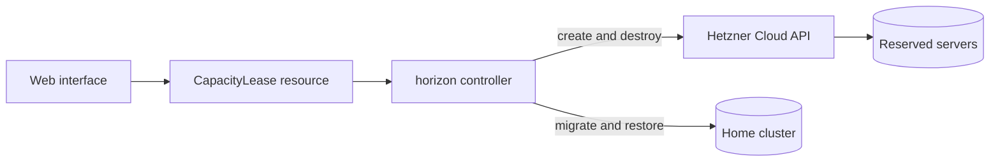

# horizon

[](https://github.com/lucawalz/horizon/actions/workflows/ci.yaml)
[](LICENSE)


Leases on-demand cloud capacity for a Kubernetes cluster and guarantees the capacity is destroyed when the lease expires.

## Description

horizon adds temporary worker capacity to a cluster that already exists, for a bounded period, and takes it away again. A lease states how much capacity, from which provider and region, for how long, and for which workload. The teardown is the point: the value of the tool is the promise that nothing is still billing after the deadline, not the provisioning itself.

The cluster horizon operates over lives in the companion [bedrock](https://github.com/lucawalz/bedrock) repository: Cluster API with the Hetzner provider (CAPH) for the permanent cluster and cluster-api-k3s for bootstrap and control planes, managed by Rancher Turtles, with Tailscale for connectivity. bedrock defines the cluster; horizon adds and removes temporary capacity on top of it. horizon is optional and never load-bearing: routine scale-out happens without it and the cluster keeps running when it is gone.

## Status

horizon is being rebuilt around an in-cluster controller, and parts of that work are not finished. Two records set the direction.

[ADR 0017](docs/adr/0017-capacity-lease-controller-over-cli-saga.md) moves orchestration out of the command line and into a `CapacityLease` custom resource reconciled by a controller. A linear command-line sequence cleans up only if the process survives to clean up, which was measured to leak a rented server on every kill; a level-triggered loop runs again after a crash by construction.

[ADR 0019](docs/adr/0019-replace-terminal-interface-with-web-and-printer-columns.md) replaces the terminal interface with a web interface, printer columns on the custom resource, and a non-interactive watch command. The terminal dashboard and the first-run setup wizard that earlier versions shipped are removed.

What works today:

- reserved server provisioning against the Hetzner Cloud API, with ownership labels that stop horizon touching a machine it did not create
- workload migration onto and off the provisioned nodes, and node drain
- cluster queries for nodes, pools, workloads, and Flux status
- `horizon version`

What is still to come:

- the `CapacityLease` custom resource and the controller that reconciles it
- the web interface, served on loopback locally or from the pod in-cluster
- the watch command and the lease verbs on the command line

Running `horizon` with no subcommand prints help. Until the surfaces above land, the capacity actions are reachable as library calls in `internal/core` rather than as commands.

## Interfaces

The two records above set out four surfaces. None of them is built yet; this is the shape the work is heading for.

The custom resource is the API. A lease is applied with `kubectl`, committed to a git tree, and reconciled by Flux like anything else in the estate, which is also what makes it scriptable and testable.

A web interface is how people use horizon. It is one server-rendered implementation with two serving modes rather than two implementations: bound to loopback by a local command, or listening in the pod when the chart enables it. It also takes over the wizard's job of supplying provider credentials and machine settings, writing them to a Secret instead of asking for a hand-written resource, and it refuses to edit a configuration that carries the ownership labels of a git reconciler.

The command line is a thin bridge. It serves the interface, prints lease state as scrolling output with no terminal framework, and offers lease verbs that are sugar over applying a resource. It stays small because the declarative path has to work and because a tool with no scriptable surface cannot be tested.

Printer columns on the custom resource carry the remaining time and the lease state, so `kubectl get`, k9s, Rancher and Headlamp are all useful without a horizon-specific client.

## Capacity model

Reserved capacity is the only on-demand path. A reserved server is operator-pinned: horizon provisions it on demand against the Hetzner Cloud API and removes it when the lease ends. It boots from the shared pool-node image and joins the cluster with the reserved cloud-init from horizon's configuration.

Ownership is enforced in code. horizon labels each server it creates `horizon.dev/managed-by=horizon` and `horizon.dev/pool=reserved`, and only ever lists or deletes servers carrying the managed-by label. A server that also carries an `hcloud/node-group` marker is refused outright, so a machine belonging to an autoscaler is never touched.

Workload placement is a contract. A pool node labels itself `horizon.dev/pool=<type>` when it joins, and horizon rewrites workload affinity to match the targeted pool and adds the `horizon.dev/burst=true:NoSchedule` toleration on each migrated Deployment and StatefulSet.

horizon carries the Hetzner API token and the node cloud-init in its own configuration, each resolved from an inline value, a file path, an environment variable, or a reference to a single key in a cluster Secret.

## Architecture

The code follows a hexagonal layout: a presentation-free core of queries and actions surrounded by adapters.

- `internal/core` holds the query surface and the action functions and depends on no presentation code.
- `internal/hcloud` provisions, lists, and deletes reserved servers.
- `internal/k8s` holds the cluster client, node drain, workload migration, Flux Kustomization and HelmRelease status, and the Kubernetes API tracer.
- `internal/provider` declares the provider interface and the node-label constants.
- `internal/config` loads and validates the configuration file.
- `internal/cli` holds the cobra root and the version command.


```mermaid
flowchart LR
  lease[CapacityLease resource] --> controller[horizon controller]
  controller -->|create and destroy| hcloud[Hetzner Cloud API]
  hcloud --> servers[(Reserved servers)]
  controller -->|migrate and restore| cluster[(Home cluster)]
  web[Web interface] --> lease
```

## Requirements

Hard requirements:

- A Kubernetes cluster and a kubeconfig with a context that reaches it.
- A Hetzner Cloud token and the reserved node cloud-init, both supplied through the `reserved` configuration block as a value, a file path, an environment variable, or a Secret reference. The shared pool-node image must be present in the Hetzner project.

Optional:

- metrics-server for the cluster CPU and memory pressure figures.
- Flux for the GitOps status.

## Installation

Building from source needs Go 1.26 or newer:

```
go build -o horizon ./cmd/horizon
```

Install it into the Go bin directory:

```
go install github.com/lucawalz/horizon/cmd/horizon@latest
```

`make install` builds and installs the binary into `~/.local/bin`, re-signing it on macOS. Override the destination with `PREFIX`, and remove it with `make uninstall`.

Tagged releases publish darwin and linux archives for amd64 and arm64 on the GitHub releases page. No container image and no Homebrew formula are published.

## Configuration

Configuration is read from `$HORIZON_CONFIG_DIR/config.yaml`, then `$XDG_CONFIG_HOME/horizon/config.yaml`, falling back to `~/.config/horizon/config.yaml`. A template is in [`config.example.yaml`](config.example.yaml).

Key fields:

- `kubeconfig`: path to the kubeconfig; empty uses the default loading rules.
- `context`: target kubeconfig context.
- `cluster`: default cluster name; falls back to the pool cluster when unset.
- `pools`: the `namespace` where the provider's MachineDeployments live, the `cluster` name, the `default_type` (`reserved`), and a `types` map from pool type to MachineDeployment name (`reserved` to `reserved-workers`).
- `reserved`: the Hetzner coordinates for reserved provisioning. `token` and `cloud_init` are credential sources, each set through one of `value` (inline), `path` (a file read from disk), `env` (an environment variable name), or `secret` (a namespace, name, and key in a cluster Secret); the cloud-init must already carry the `horizon.dev/pool=reserved` node label. `location` and `server_type` set the server shape. `image.label` and `image.value` select the boot image by label selector; `image.value` has no default and is required before a reserved server can be provisioned. `ssh_keys` defaults to empty; names are resolved to Hetzner key ids at create time.

## Releases

Pushing a `v*` tag triggers the GoReleaser workflow, which builds the darwin and linux binaries and publishes a GitHub release with the archives attached.

## Repository layout

```
cmd/horizon/        main entry point
internal/cli/       cobra root and version command
internal/core/      presentation-free query surface and action functions
internal/config/    configuration loading and schema
internal/provider/  provider interface and node-label constants
internal/hcloud/    Hetzner Cloud provider implementation for reserved servers
internal/k8s/       cluster client, drain, workload migration, Flux status, API tracer
docs/adr/           architecture decision records
```

## Contributing

Contributions are welcome. See [CONTRIBUTING.md](CONTRIBUTING.md) for the build, test, branch, and commit conventions. In short: `go build ./...`, `go test ./...`, and `golangci-lint run`, then open a PR against `main`; CI runs the same checks.

## Security

See [SECURITY.md](SECURITY.md) for the supported versions and how to report a vulnerability.

## Support

Open an issue on the [GitHub repository](https://github.com/lucawalz/horizon/issues).

## Authors and acknowledgment

Built and maintained by Luca Walz. It builds on cobra, viper, controller-runtime, client-go, the Cluster API libraries, and the Hetzner Cloud SDK.

## License

Released under the MIT License. See [LICENSE](LICENSE).

## Project status

Actively developed alongside the bedrock homelab.
