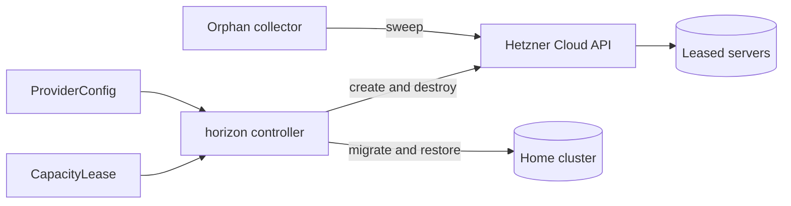

# horizon

[](https://github.com/lucawalz/horizon/actions/workflows/ci.yaml)
[](https://github.com/lucawalz/horizon/releases)
[](LICENSE)


Leases on-demand cloud capacity for a Kubernetes cluster and guarantees the capacity is destroyed when the lease expires.

## Description

horizon is a Kubernetes operator. It adds temporary worker capacity to a cluster that already exists, holds it for a bounded period, and takes it away again. A `CapacityLease` states how much capacity, from which provider and region, for how long, and for which workload. The controller provisions against that statement, moves the named workload onto the new nodes, and releases everything once the deadline passes.

Renting capacity is easy. Guaranteeing it goes away is the engineering problem, and that is what the project exists to solve: the promise on offer is that nothing is still billing after the deadline.

The cluster horizon operates over lives in the companion [bedrock](https://github.com/lucawalz/bedrock) repository: three bare-metal nodes running NixOS and K3s, reconciled by Flux v2, with Tailscale carrying connectivity for nodes that are not on the home network. bedrock defines the cluster; horizon adds and removes temporary capacity on top of it. horizon is optional and never load-bearing: routine operation happens without it and the cluster keeps running when it is gone.

## How teardown is enforced

Teardown is layered, so no single failure leaves a machine running and billing.

A finalizer blocks lease deletion until the provider confirms the instance gone, not merely reports a successful delete call. Ownership and deadline labels are written in the same call that creates the instance, so nothing horizon creates is ever unlabelled or unaccounted for. An orphan collector sweeps every configured provider on a timer and reclaims what no live lease claims; a matching reconciler does the same for stranded `Node` objects. Launch and registration are each bounded by their own deadline, past which a stuck instance is released rather than left waiting. A lease is refused before acceptance if neither the provider nor its configuration can guarantee teardown, and the schema itself bounds `replicas`, `duration`, and `teardownGrace`. That grace is a single deadline anchored at the instant teardown falls due, whether by expiry or by early deletion, not a fresh allowance per instance: the workload restore wait and every instance's drain share it, and once it is spent, release proceeds without waiting further.

The last layer runs on the leased server itself. `horizon watchdog` is a dead man's switch on two independent clocks, a monotonic backstop and a renewable wall-clock deadline pulled from the cluster, so the guarantee survives the operator, the cluster, and the network all being gone at once.

See [ADR 0017](docs/adr/0017-capacity-lease-controller-over-cli-saga.md) for the crash-safety layers and their exact parameters, [ADR 0018](docs/adr/0018-provider-seam-around-instance-lifecycle.md) for the provider seam and the label set, and [ADR 0021](docs/adr/0021-node-side-dead-mans-switch-on-two-clocks.md) for the watchdog's two clocks.

## Capacity model

Reserved capacity is the only path. An instance is operator-pinned: horizon creates it on demand against the Hetzner Cloud API and deletes it when the lease ends. See [Node join contract](#node-join-contract) for how a node identifies itself once it joins.

When a lease names a workload namespace, horizon rewrites the affinity of each Deployment and StatefulSet in it to target the reserved pool and adds the matching toleration, then restores the original placement during teardown.


```mermaid
flowchart LR
  lease[CapacityLease] --> controller[horizon controller]
  config[ProviderConfig] --> controller
  controller -->|create and destroy| hcloud[Hetzner Cloud API]
  hcloud --> servers[(Leased servers)]
  controller -->|migrate and restore| cluster[(Home cluster)]
  orphan[Orphan collector] -->|sweep| hcloud
```

## Custom resources

Both definitions are cluster-scoped and live in the `horizon.dev/v1alpha1` group. `kubectl explain capacitylease.spec` and `kubectl explain providerconfig.spec.hetzner`, or the generated definitions in `config/crd/bases/`, carry the exhaustive field list; the two examples below carry only the fields an adopter sets in practice.

### CapacityLease

`spec.providerRef`, `spec.region`, `spec.replicas`, and `spec.duration` are required, together with exactly one of `spec.size` or `spec.requirements`. `spec.size` pins an instance type by name. `spec.requirements` states a minimum core count, an optional memory floor, an architecture, an optional CPU type and a selection strategy, and horizon resolves the cheapest offered type that satisfies them. `spec.providerRef`, `spec.region` and whichever of the two sizing fields is set are immutable, so a lease cannot be repointed once it holds capacity. `spec.workload.namespace` names the namespace to migrate onto the leased nodes and omitting it adds bare capacity. Status carries `phase` (`Pending`, `Provisioning`, `Active`, `Expiring`, `Released`, or `Degraded`), the resolved `instanceType`, the per-instance provider id, node name and join stage, and conditions. A lease sized from `spec.requirements` also carries `status.selection`. It records the strategy that ran, the chosen type with its hourly rate and currency, and the runner-up, together with how many types the catalogue `offered`, how many of them `qualified`, and a tally of the rejected candidates by the filter that rejected them. The stanza is written once, alongside `status.instanceType`, and is not rewritten as the catalogue moves. A lease that pins `spec.size` makes no policy decision and carries no stanza. Printer columns expose replicas, region, phase, expiry, readiness, whether the node-side watchdog is armed, age, and the resolved instance type, in that order, and `kubectl get -o wide` adds the instants the lease became ready and was released. `kubectl get`, k9s, Rancher and Headlamp are therefore all useful without a horizon-specific client; the short name is `cl`.

```yaml
apiVersion: horizon.dev/v1alpha1
kind: CapacityLease
metadata:
  name: batch-run
spec:
  providerRef: hetzner
  region: nbg1
  size: cx22
  replicas: 2
  duration: 2h
  workload:
    namespace: batch
```

### ProviderConfig

`spec.type` is `hetzner`, the only accepted value. `spec.hetzner.credentialsSecretRef` and `spec.hetzner.cloudInitSecretRef` are required, along with exactly one of `spec.hetzner.image` (by `name`, `id`, or `selector`) or the deprecated `spec.hetzner.imageSelector`. `spec.hetzner.nodeCredentialSecretRef` is optional in the schema but required in practice: Hetzner cannot stop billing by self-terminating, so a lease is refused while it is unset. `spec.hetzner.joinTokenSecretRef` is likewise optional in the schema but required whenever the cloud-init behind `cloudInitSecretRef` uses `${HORIZON_JOIN_TOKEN}`, and every document the `k3s` flavour of `horizon cloud-init` renders does; the provider build fails, naming the field, if the sentinel is present and the reference is unset. `spec.watchdog` is required and cross-validates `renewInterval`, `slack`, and `maxLifetime` against each other.

```yaml
apiVersion: horizon.dev/v1alpha1
kind: ProviderConfig
metadata:
  name: hetzner
spec:
  type: hetzner
  hetzner:
    credentialsSecretRef:
      name: horizon-hetzner
      key: token
    cloudInitSecretRef:
      name: horizon-cloud-init
      key: cloud-init
    nodeCredentialSecretRef:
      name: horizon-hetzner-node
      key: token
    joinTokenSecretRef:
      name: horizon-join-token
      key: token
    image:
      name: ubuntu-24.04
  watchdog:
    renewInterval: 1m
    slack: 2m
    maxLifetime: 8h
```

## Node join contract

A burst node satisfies four requirements. horizon generates the first three; the fourth is the adopter's network, and horizon has no opinion about it.

1. **Join as an agent.** The server runs a Kubernetes agent pointed at the control plane, at the version `--kubernetes-version` names rather than whatever release is newest. That version has to match the control plane: a kubelet newer than the apiserver is outside the Kubernetes version skew policy, so a node that installs the latest release against an older control plane is unsupported the moment it joins. `horizon cloud-init` renders this; see [docs/usage.md](docs/usage.md). An image that already ships the agent takes `--install-kubernetes=false`, which drops the install command and keeps the join configuration. Rendering pins nothing that was rendered earlier: the provider reads the blob behind `cloudInitSecretRef` and never regenerates it, so a Secret written before the version was pinned still installs whatever release is newest, on every node it boots, until it is re-rendered and applied over the old one. Upgrading the control plane is the other half of the same rule, and needs the same re-render.
2. **Carry `horizon.dev/pool=reserved` and the burst taint.** The provider build rejects a cloud-init missing the pool label, before any instance is created. The taint, `horizon.dev/burst=<lease>:NoSchedule`, is applied by the controller once it matches the node to its lease, since its value is the lease name and one cloud-init blob serves every lease a `ProviderConfig` provisions.
3. **Install and arm the watchdog.** `horizon cloud-init` writes the node token and a systemd unit that starts `horizon watchdog` on boot, unless `--install-watchdog-unit=false`. An image whose `/etc/systemd/system` is read-only, a NixOS image among them, takes `--transient-watchdog-unit` instead, which writes the unit to `/run/systemd/system` from a per-boot script and starts it rather than enabling it.
4. **Reach the control plane.** horizon has no VPN, no firewall management, and no opinion about how a leased server reaches the cluster beyond the `--server` URL it is given; getting a packet from Hetzner's network to the control plane is the adopter's problem, the same way it is bedrock's Tailscale for the nodes it runs permanently. Where that path is a VPN, the agent also has to be told to run its pod network over the tunnel, which is `--flavor-config flannel-iface=<interface>` for k3s.

Four sentinels are substituted when the provider builds the cloud-init: `${HORIZON_NODE_TOKEN}` and `${HORIZON_JOIN_TOKEN}` from their Secret references, `${HORIZON_VERSION}` from the controller's build stamp, `${HORIZON_MAX_LIFETIME}` from `spec.watchdog.maxLifetime`. Substitution is literal text replacement; anything else starting `${HORIZON_` left standing afterward fails the provider build rather than boot with a placeholder where a credential belongs.

## Configuration

Configuration is the `ProviderConfig` resource plus the Secrets it points at. There is no configuration file, and the binary reads none.

Secret references are resolved in the namespace the controller runs in, taken from the `POD_NAMESPACE` environment variable and falling back to the service account namespace file projected into the pod. A `ProviderConfig` is cluster-scoped, so the reference carries a name and a key but no namespace.

## Architecture

The controller is built on controller-runtime. The provider is a seam rather than a dependency, so the reconcilers never reach a cloud SDK directly; see [ADR 0018](docs/adr/0018-provider-seam-around-instance-lifecycle.md). [Repository layout](#repository-layout) below maps each package to what it owns.

## Installation

horizon installs as a Helm chart into an existing cluster. Nothing else is deployed, and the cluster keeps running unchanged until a lease is created.

### Requirements

Hard requirements:

- A Kubernetes cluster at 1.29 or newer, and permission to install cluster-scoped custom resource definitions and RBAC into it.
- A Hetzner Cloud API token and a cloud-init that joins the cluster and applies the `horizon.dev/pool=reserved` node label, each stored in a Secret in the controller's namespace. `horizon cloud-init` generates the second; see [docs/usage.md](docs/usage.md).
- A delete-capable Hetzner Cloud API token for the leased machines, stored in a Secret in the controller's namespace and named by `nodeCredentialSecretRef`. Hetzner cannot stop billing by self-terminating, so no lease is accepted while that reference is unset.
- A k3s join token, stored in a Secret in the controller's namespace and named by `joinTokenSecretRef`. Every cloud-init `horizon cloud-init` generates needs it, and the provider build fails before any instance is created while the reference is unset.
- A boot image in the Hetzner project, selected by exact id, exact name, or one or more labels.

### Installing the controller

The controller is installed from the Helm chart, published as an OCI artifact by a release tag:

```
helm install horizon oci://ghcr.io/lucawalz/charts/horizon \
  --namespace horizon-system --create-namespace
```

That resolves against the latest published chart. A checkout installs the working tree instead, which is ahead of the published chart while a release is being prepared:

```
helm install horizon ./charts/horizon --namespace horizon-system --create-namespace
```

The chart templates the controller Deployment, its ServiceAccount, a ClusterRole and binding for the cluster-scoped work, a namespaced Role and binding for leader election and Secret reads, a Service, and the two custom resource definitions. See [`charts/horizon/README.md`](charts/horizon/README.md) for every value and for why the definitions live in `crds/` rather than `templates/`.

Building from source needs Go 1.26 or newer:

```
make build
```

`make install` builds and installs the binary into `~/.local/bin`, re-signing it on macOS. Override the destination with `PREFIX`, and remove it with `make uninstall`. The binary is the controller, so it is only useful where it can reach a cluster.

## Usage

### The smallest example

With the chart installed and a `ProviderConfig` applied, a lease is the whole interface. This one asks for a single `cx22` in `nbg1` for thirty minutes:

```yaml
apiVersion: horizon.dev/v1alpha1
kind: CapacityLease
metadata:
  name: batch-run
spec:
  providerRef: hetzner
  region: nbg1
  size: cx22
  replicas: 1
  duration: 30m
```

```
kubectl apply -f capacitylease.yaml
kubectl get capacityleases
```

which prints the lease once its node has registered and its watchdog has armed:

```
NAME        REPLICAS   REGION   PHASE    EXPIRES                READY   ARMED   AGE   TYPE
batch-run   1          nbg1     Active   2026-08-24T14:30:00Z   True    True    92s   cx22
```

Deleting the lease releases the capacity early; leaving it alone releases it at `EXPIRES`. Either way the finalizer holds the deletion open until the provider confirms every instance gone.

```
kubectl delete capacitylease batch-run
```

Getting an empty cluster to that point is eight steps: the chart, three Secrets, a rendered cloud-init, a fourth Secret holding it, a `ProviderConfig`, and the lease. [docs/usage.md](docs/usage.md) walks all eight with the commands and the rendered output, and covers images and clusters that are not stock.

### Web interface

`horizon dashboard` serves the interface from the machine it runs on, reading the cluster with the caller's own kubeconfig credentials:

```
horizon dashboard
```

That credential is the whole of its authentication, so the listener binds `127.0.0.1` and nothing else; only the port is a flag. The interface lists leases with a countdown that ticks in the browser rather than on the network, and opens each lease onto its reservation, timeline, conditions, instances and migrated workloads. It creates a lease from a form and releases one by deleting it. What it shows and how mutation is guarded is in [docs/usage.md](docs/usage.md#web-interface); the reasoning is in [ADR 0025](docs/adr/0025-replace-server-rendered-interface-with-embedded-spa.md) and [ADR 0027](docs/adr/0027-mutating-web-interface-behind-a-typed-writer-and-a-cross-origin-guard.md).

### Serving the interface in a cluster

`horizon serve` serves the same interface on a routable address, for a team rather than for one operator at one terminal:

```
horizon serve --oidc-issuer=https://sso.example.com/application/o/horizon/ \
  --oidc-audience=horizon --external-origin=https://horizon.example.com
```

Every request has to carry a signed JWT, verified against the key set discovered from the issuer's own `/.well-known/openid-configuration` document. Authorisation is Kubernetes impersonation of the username and groups that token names, so the cluster's own RBAC decides what a caller reaches and the interface grants nothing on its own. The chart templates the mode behind `ui.enabled` and the default is off. [docs/serving-the-interface.md](docs/serving-the-interface.md) covers what an identity provider has to publish, how to grant an impersonated operator its rights, and the security properties the arrangement rests on. The reasoning is in [ADR 0028](docs/adr/0028-serve-the-interface-in-cluster-behind-a-verified-token-and-impersonation.md).

### Command line reference

Six commands, and `horizon` with no subcommand prints help:

```
horizon controller   Run the in-cluster capacity lease controller
horizon dashboard    Serve the web interface on loopback
horizon serve        Serve the web interface on a routable address behind an OIDC issuer
horizon watchdog     Enforce the node-side teardown deadline from the leased server itself
horizon cloud-init   Render the cloud-init a burst node needs to join a cluster
horizon version      Print the build version
```

Every flag, with its default and what it is for, is in [docs/cli-reference.md](docs/cli-reference.md).

## Documentation

The README is the front page. Everything longer lives beside it.

| Document | What it covers |
| --- | --- |
| [docs/usage.md](docs/usage.md) | The eight-step path from an empty cluster to a leased node registering, images and clusters that are not stock, and what the web interface serves. |
| [docs/cli-reference.md](docs/cli-reference.md) | Every command and every flag, with its default and what it is for. |
| [docs/serving-the-interface.md](docs/serving-the-interface.md) | Serving the interface in a cluster: what an identity provider has to publish, granting an impersonated operator its rights, narrowing the impersonation permission, and reading a refusal. |
| [charts/horizon/README.md](charts/horizon/README.md) | Every chart value, why the custom resource definitions live in `crds/` rather than `templates/`, and the identity separation between the controller and the interface. |
| [docs/adr/](docs/adr/) | Twenty-eight architecture decision records in MADR format. Superseded records are kept rather than deleted, because the reasoning that was later overturned is the useful part. |
| [CONTRIBUTING.md](CONTRIBUTING.md) | Prerequisites, the test commands, the web interface bundle, and the branch and commit conventions. |
| [SECURITY.md](SECURITY.md) | The credential model and how to report a vulnerability. |

## Releases

`charts/horizon/Chart.yaml` is the source of truth for the released version; bumping it is a deliberate commit that precedes the tag. Pushing a `v*` tag builds the linux amd64 and arm64 image, packages the chart, and only then publishes the GitHub release, in that order, so a published release always advertises an image and a chart that exist. See [ADR 0020](docs/adr/0020-chart-yaml-as-the-release-version-source-of-truth.md) for the full contract.

The image is distroless and runs as uid 65532. The archive binaries and the image binary are built with `-trimpath` and identical linker flags, so the two are byte-identical for a given platform.

## Repository layout

```
api/v1alpha1/       CapacityLease and ProviderConfig types
cmd/horizon/        main entry point
internal/cli/       cobra root, version, controller, dashboard, serve, watchdog, and cloud-init commands
internal/agent/     node-side dead man's switch
internal/manager/   controller-runtime wiring
internal/web/       web interface, json endpoints and the embedded bundle
                    site/ vite, react and typescript project, dist/ committed
internal/oidc/      bearer token verification against the issuer's published key set
internal/controller/  lease reconciler, orphan collector, provider factory
internal/k8s/       workload migration, placement restore, node drain
internal/cloudinit/ cloud-init join document generator, one file per flavour
internal/provider/  instance lifecycle interface, capabilities, label constants
                    hetzner/ Hetzner Cloud implementation
                    conformance/ contract suite every implementation must pass
                    fake/ in-memory implementation with a create and delete ledger
internal/version/   build stamp
config/crd/bases/   generated custom resource definitions
charts/horizon/     Helm chart for the in-cluster controller and the optional interface
docs/               usage guide, command line reference, and the guide to
                    serving the interface in a cluster
docs/adr/           architecture decision records
```

## Support

Bug reports, feature requests and questions all go to the [issue tracker](https://github.com/lucawalz/horizon/issues). Two templates are offered, [bug report](.github/ISSUE_TEMPLATE/bug_report.md) and [feature request](.github/ISSUE_TEMPLATE/feature_request.md), and filling one in saves a round trip. There is no chat room and no mailing list.

A refusal from the in-cluster interface, `401`, `403` or `501`, is decoded in [docs/serving-the-interface.md](docs/serving-the-interface.md#reading-a-refusal). A lease that reaches `Provisioning` and stays there is a known gap: `InstancesReady` reports a count and does not separate a machine still booting from one that will never join, so the lease conditions do not say which it is.

A suspected vulnerability is the one thing that does not belong in a public issue.

## Security

Report a suspected vulnerability privately, through the "Report a vulnerability" form under the repository's Security tab, rather than by opening a public issue. Only `main` is maintained.

[SECURITY.md](SECURITY.md) states the credential model in full. The short version is that a provider token able to create servers is also able to delete them and to bill the account that owns them, which is why the operator's credential and the credential that reaches a leased machine are separate tokens that rotate independently, and why a Hetzner project containing only ephemeral capacity is the only blast radius control the provider offers. No secret is stored in this repository, and every configuration example uses a placeholder.

## Roadmap

Nothing here carries a date. The list is what the repository itself records as absent, not a product plan, and the seams named in it exist already.

- **Provider credential writing from the interface.** Lease creation and release have landed. Writing a `ProviderConfig` and the Secrets behind it is the half of the mutating surface that stays unbuilt, so configuring a provider is still a `kubectl` job.
- **`ProviderConfig` status conditions.** The status subresource exists on the type and stays empty, so a misconfigured provider is currently diagnosed from a lease's conditions rather than from the object that is actually wrong.
- **A better answer for a node that never joins.** `InstancesReady` reports a count and does not separate a machine still booting from one that booted a quarter of an hour ago and is never going to join.
- **A second provider behind the conformance suite.** `spec.type` accepts `hetzner` and nothing else today. The seam and the contract suite in `internal/provider/conformance/` exist so that a second implementation is a package satisfying an interface rather than a rewrite; none has been written.
- **A second cloud-init flavour.** `--flavor` accepts `k3s` and nothing else, on the same shape: one file per flavour under `internal/cloudinit/`.
- **`site` as a required status check.** CI rebuilds the committed web bundle and fails when it differs from what is in the tree, but branch protection does not require the job, so a stale `dist/` is reported rather than blocked. [CONTRIBUTING.md](CONTRIBUTING.md#required-status-checks) carries the command that closes the gap.

The `watch` command and the lease verbs are not on this list and are not planned. Printer columns on `kubectl get capacityleases` cover what they would have done.

## Contributing

Contributions are welcome. Opening an issue before a large change saves work on both sides; a small fix can go straight to a pull request.

[CONTRIBUTING.md](CONTRIBUTING.md) is the full guide. The prerequisites are Go 1.26 or newer, `kubectl` pointed at a cluster for exercising the operator outside the test suite, `golangci-lint`, `helm` and a container runtime with buildx when the chart or the image changes, and Node at the version pinned in `internal/web/site/.nvmrc` when the web interface changes.

```bash
go build ./...
make test          # unit and integration, with the envtest control plane binaries
make test-race     # the same suite under the race detector
golangci-lint run ./...
make chart-lint    # helm lint, plus the check that crds/ matches the generated manifests
```

`go test ./...` still exits zero, but the controller suite skips every case that needs an apiserver when it cannot find the envtest binaries, so `make test` is the invocation that runs everything. A change to the API types needs `make manifests`, which regenerates the custom resource definitions and copies them into the chart. A change under `internal/web/site` needs the bundle rebuilt with `npm ci && npm run build` and the result committed, because it is embedded into the binary.

Branches follow [Conventional Branch](https://conventionalbranch.org/) and commits follow [Conventional Commits](https://www.conventionalcommits.org/), both spelled out with examples in CONTRIBUTING.md. Open the pull request against `main` and fill in the template. CI runs six jobs, `test`, `lint`, `site`, `release-config`, `chart` and `image`; branch protection currently requires `test` and `chart`, and the others report without blocking.

A pull request that introduces or changes an architectural decision carries an ADR in [docs/adr/](docs/adr/), in MADR format, in the same change.

## Authors and acknowledgment

Built and maintained by Luca Walz.

horizon rests on work it did not write. controller-runtime and client-go carry the reconcile loop and every call to the apiserver, and the kubectl drain libraries carry the eviction. cobra carries the command line, the Hetzner Cloud SDK carries the provider, and controller-gen generates the custom resource definitions from the Go types. The web interface is React and TypeScript, built by Vite and styled with Tailwind. Releases are cut by GoReleaser and packaged with Helm, and the decision records follow [MADR](https://adr.github.io/madr/).

The cluster horizon was written against is [bedrock](https://github.com/lucawalz/bedrock), which defines it. horizon only borrows it, and is careful to give it back.

## License

Released under the MIT License, Copyright (c) 2026 Luca Walz. The full text is in [LICENSE](LICENSE).

It permits use, copying, modification, merging, publication, distribution, sublicensing and sale, commercially included, on the single condition that the copyright notice and the licence text travel with the software or a substantial portion of it. The software is provided as is, and the licence disclaims every warranty and all liability.

## Project status

Actively developed, alongside the [bedrock](https://github.com/lucawalz/bedrock) homelab it was written for. The chart and the image are published at `ghcr.io/lucawalz/charts/horizon` and `ghcr.io/lucawalz/horizon`, one version per release tag, and the badge above names the latest. `charts/horizon/Chart.yaml` declares the version the next tag will publish, so a checkout is ahead of both registries while a release is being prepared.

Implemented: the `CapacityLease` and `ProviderConfig` definitions; the lease controller and its layered teardown guarantee, above; workload migration and node drain; the Hetzner provider behind a conformance-tested seam; image selection by id, name, or label; cloud-init generation; the Helm chart; the single-page web interface served locally by `horizon dashboard`, which creates and releases leases as well as reading them; the in-cluster mode of the same interface, served by `horizon serve` behind a verified OIDC token and Kubernetes impersonation, templated by the chart behind `ui.enabled` and off by default; six commands, `horizon controller`, `horizon dashboard`, `horizon serve`, `horizon watchdog`, `horizon cloud-init`, `horizon version`.

Not implemented: provider credential writing from the interface, which is the half of its mutating surface that stays unbuilt now that lease creation and release have landed; the `watch` command and lease verbs, `kubectl get capacityleases` covers this with printer columns; `ProviderConfig` status conditions, the subresource exists and stays empty. [Roadmap](#roadmap) says which of these are intended and which are not.
