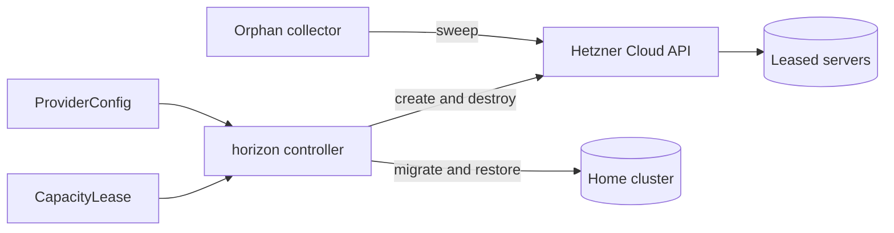

# horizon

[](https://github.com/lucawalz/horizon/actions/workflows/ci.yaml)
[](https://github.com/lucawalz/horizon/releases)
[](LICENSE)


Leases on-demand cloud capacity for a Kubernetes cluster and guarantees the capacity is destroyed when the lease expires.

## Description

horizon is a Kubernetes operator. It adds temporary worker capacity to a cluster that already exists, holds it for a bounded period, and takes it away again. A `CapacityLease` states how much capacity, from which provider and region, for how long, and for which workload. The controller provisions against that statement, moves the named workload onto the new nodes, and releases everything once the deadline passes.

Renting capacity is easy. Guaranteeing it goes away is the engineering problem, and that is what the project exists to solve: the promise on offer is that nothing is still billing after the deadline.

The cluster horizon operates over lives in the companion [bedrock](https://github.com/lucawalz/bedrock) repository: three bare-metal nodes running NixOS and K3s, reconciled by Flux v2, with Tailscale carrying connectivity for nodes that are not on the home network. bedrock defines the cluster; horizon adds and removes temporary capacity on top of it. horizon is optional and never load-bearing: routine operation happens without it and the cluster keeps running when it is gone.


```mermaid
flowchart LR
  lease[CapacityLease] --> controller[horizon controller]
  config[ProviderConfig] --> controller
  controller -->|create and destroy| hcloud[Hetzner Cloud API]
  hcloud --> servers[(Leased servers)]
  controller -->|migrate and restore| cluster[(Home cluster)]
  orphan[Orphan collector] -->|sweep| hcloud
```

### Features

- Capacity is a `CapacityLease`; `kubectl`, k9s and Headlamp are the whole client.
- Teardown layers a finalizer, orphan collector, deadline checks, and a node watchdog.
- A leased server self-destructs if the cluster stops renewing its deadline.
- A lease pins a type or states requirements; horizon resolves cheapest match.
- Naming a namespace moves its workloads onto leased nodes, restored at teardown.
- `horizon cloud-init` renders the join document for stock and non-stock images.
- That binary serves the interface, on loopback or OIDC-secured for a team.

## How teardown is enforced

Teardown is layered, so no single failure leaves a machine running and billing. On the cluster side, a finalizer blocks lease deletion until the provider confirms the instance gone, ownership and deadline labels are written at creation so nothing horizon makes goes unaccounted for, an orphan collector and a matching reconciler sweep on a timer for anything no live lease or Node claims, and launch and registration deadlines release a stuck instance rather than wait on it forever. On the machine itself, `horizon watchdog` is a dead man's switch on a monotonic backstop and a renewable wall-clock deadline pulled from the cluster, so the guarantee survives the operator, the cluster, and the network all being gone at once.

See [ADR 0017](docs/adr/0017-capacity-lease-controller-over-cli-saga.md) for the crash-safety layers and their exact parameters, [ADR 0018](docs/adr/0018-provider-seam-around-instance-lifecycle.md) for the provider seam and the label set, and [ADR 0021](docs/adr/0021-node-side-dead-mans-switch-on-two-clocks.md) for the watchdog's two clocks. [docs/usage.md](docs/usage.md#how-teardown-is-enforced) carries the full mechanism, including `teardownGrace`.

## Capacity model

Reserved capacity is the only path. An instance is operator-pinned: horizon creates it on demand against the Hetzner Cloud API and deletes it when the lease ends. [docs/usage.md](docs/usage.md#images-and-clusters-that-are-not-stock) carries the node join contract: the four requirements a burst node satisfies to register, and the sentinels substituted into its cloud-init.

## Installation

horizon installs as a Helm chart into an existing cluster. Nothing else is deployed, and the cluster keeps running unchanged until a lease is created.

### Requirements

- A Kubernetes cluster at 1.29 or newer, and permission to install cluster-scoped custom resource definitions and RBAC into it.
- A Hetzner Cloud API token and a cloud-init that joins the cluster and applies the `horizon.dev/pool=reserved` node label, each stored in a Secret in the controller's namespace. `horizon cloud-init` generates the second; see [docs/usage.md](docs/usage.md).
- A delete-capable Hetzner Cloud API token for the leased machines, stored in a Secret in the controller's namespace and named by `nodeCredentialSecretRef`. Hetzner cannot stop billing by self-terminating, so no lease is accepted while that reference is unset.
- A k3s join token, stored in a Secret in the controller's namespace and named by `joinTokenSecretRef`. Every cloud-init `horizon cloud-init` generates needs it, and the provider build fails before any instance is created while the reference is unset.
- A boot image in the Hetzner project, selected by exact id, exact name, or one or more labels.

### Installing the controller

The controller is installed from the Helm chart, published as an OCI artifact by a release tag:

```
helm install horizon oci://ghcr.io/lucawalz/charts/horizon \
  --namespace horizon-system --create-namespace
```

That resolves against the latest published chart. A checkout installs the working tree instead, which is ahead of the published chart while a release is being prepared:

```
helm install horizon ./charts/horizon --namespace horizon-system --create-namespace
```

[`charts/horizon/README.md`](charts/horizon/README.md) carries every value, what else the chart templates, and why the definitions live in `crds/` rather than `templates/`.

Building from source needs Go 1.26 or newer:

```
make build
```

`make install` builds and installs the binary into `~/.local/bin`, re-signing it on macOS. Override the destination with `PREFIX`, and remove it with `make uninstall`. The binary is the controller, so it is only useful where it can reach a cluster.

## Usage

horizon carries six commands in one binary, and `horizon` with no subcommand prints help. Every flag, with its default and what it is for, is in [docs/cli-reference.md](docs/cli-reference.md).

### The smallest example

With the chart installed and a `ProviderConfig` applied, a lease is the whole interface. This one asks for a single `cpx22` in `nbg1` for thirty minutes:

```yaml
apiVersion: horizon.dev/v1alpha1
kind: CapacityLease
metadata:
  name: batch-run
spec:
  providerRef: hetzner
  region: nbg1
  size: cpx22
  replicas: 1
  duration: 30m
```

`spec.providerRef`, `spec.region`, `spec.replicas` and `spec.duration` are required, together with exactly one of `spec.size` or `spec.requirements`. `spec.size` pins an instance type by name; `spec.requirements` states a minimum core count, an optional memory floor, an architecture, an optional CPU type and a selection strategy, and horizon resolves the cheapest offered type that satisfies them. The provider reference, the region and whichever sizing field is set are immutable, so a lease cannot be repointed once it holds capacity. Adding `spec.workload.namespaces` migrates every namespace it names onto the leased nodes, narrowed to the workloads matched by the optional `spec.workload.selector`; omitting `spec.workload` adds bare capacity. `spec.duration` is mutable, and `status.expiresAt` is derived from it on every pass rather than stamped at acceptance, so editing it moves the deadline of a running lease. The derived deadline is held at the backstop each machine latched when it was created, because a leased server destroys itself at the `maxLifetime` baked into its cloud-init and nothing in the cluster can renew that; an `ExpiryClamped` condition reports when the backstop is what the deadline reads. Shortening a duration below the time already elapsed expires the lease at once, which spends the teardown grace before teardown begins and so releases the capacity without draining it first. `kubectl explain capacitylease.spec` and the generated definitions in `config/crd/bases/` carry the exhaustive field list.

A lease names the workload it exists for as a target set. Every namespace in `spec.workload.namespaces` is migrated, and the optional `spec.workload.selector` narrows the move to the workloads inside them that carry the labels it names:

```yaml
spec:
  workload:
    namespaces: [team-a, team-b]
    selector:
      matchLabels:
        tier: batch
```

Each namespace is migrated on its own, so one that fails leaves the others where the lease put them. `status.migratedWorkloads` names everything that moved as `namespace/kind/name`, and a lease that migrated some of its namespaces and not all of them holds `WorkloadMigrated` false with the reason `PartialMigration` rather than reporting a bare failure. Teardown restores whatever that list names, whether or not the migration ever completed, and reads the namespaces to reach out of the list rather than out of the spec, which stays editable while the lease lives. The list only grows until a restore succeeds, so a passing failure cannot erase the record of what has to be put back. A target set that names no Deployment or StatefulSet at all, which a selector matching nothing is the easy way to reach, holds `WorkloadMigrated` false with the reason `EmptyTargetSet` rather than reporting a move of nothing as done.

`spec.workload.mode` chooses what the lease does with what it matched. The default is `move`, which is everything above. The alternative is `replicate`, which never writes to the matched workload at all: it creates a copy of each matched Deployment in the same namespace, pinned to the leased nodes and running `spec.workload.burstReplicas` pods, and deletes that copy at teardown. `burstReplicas` counts pods and is required in replicate mode and rejected in move mode, while `spec.replicas` one level up counts machines. The mode is immutable once the lease exists, and the mode the lease placed in is recorded in `status.placedWorkloadMode`, because teardown has to undo what the lease did rather than what the spec asks for by then.

```yaml
spec:
  replicas: 2
  workload:
    namespaces: [team-a]
    mode: replicate
    burstReplicas: 6
```

The copy is named `<original>-burst-<hash>` and carries the original's labels plus `horizon.dev/burst-copy`, so a Service already in front of the original load-balances across the burst replicas without being told about them. Anything else selecting those labels reaches them too, including the original's PodDisruptionBudget, whose accounting then covers pods it was not written for; that is recorded in `status.migrationWarnings` rather than treated as a refusal. A workload a HorizontalPodAutoscaler targets is skipped instead of copied, because the autoscaler would read the copy's pods as the workload being over-provisioned and scale the original down; the recorded reason names move mode, which changes no replica count, as the way to burst that workload. A StatefulSet is skipped as well, since a copy of one gets empty volumes. So is a workload carrying a `DoNotSchedule` topology spread constraint, because the copy's pods count into the original's own domains and can leave the original's next pod Pending, and so is a workload whose selector already carries this lease's `horizon.dev/burst-copy` label, because the copy's selector would then name the original's pods as well. The copy keeps the original's pod anti-affinity so the burst replicas still spread over the rented nodes, and drops its priority class so it cannot preempt what already runs there. Replicate mode reports `WorkloadReplicable` rather than the `WorkloadMigratable` verdict, which describes a rollout it never performs, and holds it false when the target set names nothing or when every matched workload was skipped. The reasoning is in [ADR 0035](docs/adr/0035-replicate-a-workload-as-a-lease-owned-copy.md).

Before moving anything, horizon classifies every targeted Deployment and StatefulSet and records the ones that cannot move without dropping traffic, in `status.migrationWarnings` and the `WorkloadMigratable` condition. It warns rather than refuses, because a lease that quietly declines to move a workload is worse than one that moves it noisily. Six shapes are flagged: a paused Deployment, a StatefulSet on `OnDelete`, and a StatefulSet with a rollout partition all leave their pods for the operator to cycle, so horizon evicts those pods itself rather than waiting for a rollout that will never come; a Deployment on `Recreate`, and one whose `maxSurge` resolves to zero, both take every replica down before bringing a replacement up; and a workload pinned by `spec.template.spec.nodeSelector` has that selector saved and cleared for the duration of the lease, because a selector naming the original nodes cannot be satisfied on burst capacity. Teardown restores the selector alongside the affinity and the tolerations.

```
kubectl apply -f capacitylease.yaml
kubectl get capacityleases
```

Printer columns carry replicas, region, phase, expiry, readiness, whether the node-side watchdog is armed, age and the resolved instance type, and `kubectl get -o wide` adds the instants the lease became ready and was released. `kubectl get`, k9s, Rancher and Headlamp are therefore all useful without a horizon-specific client, and the short name is `cl`.

That prints the lease once its node has registered and its watchdog has armed:

```
NAME        REPLICAS   REGION   PHASE    EXPIRES                READY   ARMED   AGE   TYPE
batch-run   1          nbg1     Active   2026-08-24T14:30:00Z   True    True    92s   cpx22
```

Deleting the lease releases the capacity early; leaving it alone releases it at `EXPIRES`. Either way the finalizer holds the deletion open until the provider confirms every instance gone.

```
kubectl delete capacitylease batch-run
```

Getting an empty cluster to that point is eight steps: the chart, three Secrets, a rendered cloud-init, a fourth Secret holding it, a `ProviderConfig`, and the lease. [docs/usage.md](docs/usage.md) walks all eight with the commands and the rendered output, and covers images and clusters that are not stock.

### Web interface

`horizon dashboard` serves the interface from the machine it runs on, reading the cluster with the caller's own kubeconfig credentials:

```
horizon dashboard
```

That credential is the whole of its authentication, so the listener binds `127.0.0.1` and nothing else; only the port is a flag. The interface lists leases with a countdown that ticks in the browser rather than on the network, and opens each lease onto its reservation, timeline, conditions, instances and migrated workloads. It creates a lease from a form, extends or releases one, and creates, replaces and deletes a `ProviderConfig` from forms that reference Secrets and create none. What it shows and how mutation is guarded is in [docs/usage.md](docs/usage.md#web-interface); the reasoning is in [ADR 0025](docs/adr/0025-replace-server-rendered-interface-with-embedded-spa.md), [ADR 0027](docs/adr/0027-mutating-web-interface-behind-a-typed-writer-and-a-cross-origin-guard.md), [ADR 0033](docs/adr/0033-create-a-provider-config-from-the-interface.md) and [ADR 0036](docs/adr/0036-edit-and-delete-a-provider-config-behind-a-controller-finalizer.md).

`horizon serve` serves the same interface on a routable address, for a team rather than for one operator at one terminal:

```
horizon serve --oidc-issuer=https://sso.example.com/application/o/horizon/ \
  --oidc-audience=horizon --external-origin=https://horizon.example.com
```

Every request has to carry a signed JWT, verified against the key set discovered from the issuer's own `/.well-known/openid-configuration` document. Authorisation is Kubernetes impersonation of the username and groups that token names, so the cluster's own RBAC decides what a caller reaches and the interface grants nothing on its own. The chart templates the mode behind `ui.enabled` and the default is off. [docs/serving-the-interface.md](docs/serving-the-interface.md) covers what an identity provider has to publish and how to grant an impersonated operator its rights. The reasoning is in [ADR 0028](docs/adr/0028-serve-the-interface-in-cluster-behind-a-verified-token-and-impersonation.md).

## Documentation

| Document | What it covers |
| --- | --- |
| [docs/usage.md](docs/usage.md) | The eight-step path from an empty cluster to a registered node, images and clusters that are not stock, and what the web interface serves. |
| [docs/cli-reference.md](docs/cli-reference.md) | Every command and every flag, with its default. |
| [docs/serving-the-interface.md](docs/serving-the-interface.md) | Serving the interface in a cluster, granting an impersonated operator its rights, and reading a refusal. |
| [charts/horizon/README.md](charts/horizon/README.md) | Every chart value, and why the custom resource definitions live in `crds/` rather than `templates/`. |
| [docs/adr/](docs/adr/) | Thirty-seven architecture decision records in MADR format, superseded ones included. |
| [CONTRIBUTING.md](CONTRIBUTING.md) | Repository layout, the test commands, the web interface bundle, and the branch and commit conventions. |
| [SECURITY.md](SECURITY.md) | The credential model and how to report a vulnerability. |

## Releases

`charts/horizon/Chart.yaml` is the source of truth for the released version; bumping it is a deliberate commit that precedes the tag. Pushing a `v*` tag builds the linux amd64 and arm64 image, packages the chart, and only then publishes the GitHub release, in that order, so a published release always advertises an image and a chart that exist. See [ADR 0020](docs/adr/0020-chart-yaml-as-the-release-version-source-of-truth.md) for the full contract.

The image is distroless and runs as uid 65532. The archive binaries and the image binary are built with `-trimpath` and the same linker flags.

## Support

Bug reports, feature requests and questions all go to the [issue tracker](https://github.com/lucawalz/horizon/issues). Two templates are offered, [bug report](.github/ISSUE_TEMPLATE/bug_report.md) and [feature request](.github/ISSUE_TEMPLATE/feature_request.md), and filling one in saves a round trip. There is no chat room and no mailing list.

A refusal from the in-cluster interface, `401`, `403` or `501`, is decoded in [docs/serving-the-interface.md](docs/serving-the-interface.md#reading-a-refusal).

A suspected vulnerability is the one thing that does not belong in a public issue.

## Security

Report a suspected vulnerability privately, through the "Report a vulnerability" form under the repository's Security tab, rather than by opening a public issue. [SECURITY.md](SECURITY.md) states the credential model and the supported release line in full.

## Roadmap

- Secret writing from the interface: it is created, changed and deleted from the browser, but the Secrets a configuration points at still need `kubectl`.
- A better answer for a node that never joins, since `InstancesReady` counts without separating one still booting from one stuck.
- A second provider behind the conformance suite in `internal/provider/conformance/`; only `hetzner` exists today.
- A second cloud-init flavour; only `k3s` exists today, on the same one-file-per-flavour shape under `internal/cloudinit/`.
- `site` as a required status check, so a stale committed web bundle blocks a merge rather than only being reported.

The `watch` command and the lease verbs are not on this list and are not planned. Printer columns on `kubectl get capacityleases` cover what they would have done.

## Contributing

Contributions are welcome. Opening an issue before a large change saves work on both sides; a small fix can go straight to a pull request.

[CONTRIBUTING.md](CONTRIBUTING.md) is the full guide, covering the prerequisites, the test commands, the committed web bundle, and the branch and commit conventions.

## Authors and acknowledgment

Built and maintained by Luca Walz.

horizon rests on work it did not write. controller-runtime and client-go carry the reconcile loop and every call to the apiserver, and the kubectl drain libraries carry the eviction. cobra carries the command line, the Hetzner Cloud SDK carries the provider, and controller-gen generates the custom resource definitions from the Go types. The web interface is React and TypeScript, built by Vite and styled with Tailwind. Releases are cut by GoReleaser and packaged with Helm, and the decision records follow [MADR](https://adr.github.io/madr/).

The cluster horizon was written against is [bedrock](https://github.com/lucawalz/bedrock), which defines it. horizon only borrows it, and is careful to give it back.

## License

Released under the MIT License, Copyright (c) 2026 Luca Walz. The full text is in [LICENSE](LICENSE).

## Project status

Actively developed alongside the [bedrock](https://github.com/lucawalz/bedrock) homelab it was written for, and published one version per release tag at `ghcr.io/lucawalz/charts/horizon` and `ghcr.io/lucawalz/horizon`.
