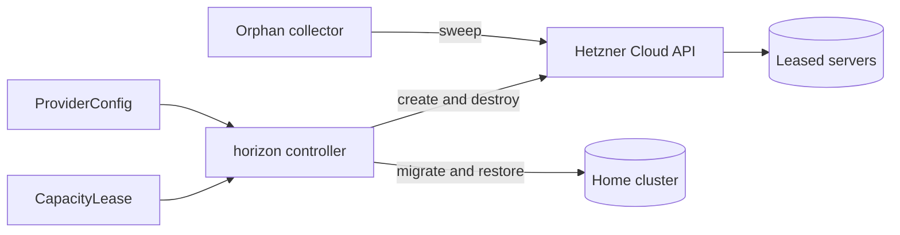

# horizon

[](https://github.com/lucawalz/horizon/actions/workflows/ci.yaml)
[](https://github.com/lucawalz/horizon/releases)
[](LICENSE)


Leases on-demand cloud capacity for a Kubernetes cluster and guarantees the capacity is destroyed when the lease expires.

## Description

horizon is a Kubernetes operator. It adds temporary worker capacity to a cluster that already exists, holds it for a bounded period, and takes it away again. A `CapacityLease` states how much capacity, from which provider and region, for how long, and for which workload. The controller provisions against that statement, moves the named workload onto the new nodes, and releases everything once the deadline passes.

Renting capacity is easy. Guaranteeing it goes away is the engineering problem, and that is what the project exists to solve: the promise on offer is that nothing is still billing after the deadline.

The cluster horizon operates over lives in the companion [bedrock](https://github.com/lucawalz/bedrock) repository: three bare-metal nodes running NixOS and K3s, reconciled by Flux v2, with Tailscale carrying connectivity for nodes that are not on the home network. bedrock defines the cluster; horizon adds and removes temporary capacity on top of it. horizon is optional and never load-bearing: routine operation happens without it and the cluster keeps running when it is gone.

### Features

- Capacity is declared as a `CapacityLease` and reconciled by an operator, so `kubectl`, k9s and Headlamp are the whole client.
- Teardown is layered across a finalizer, an orphan collector, launch and registration deadlines, and a dead man's switch on the leased server itself.
- A leased server destroys itself once the cluster stops renewing its deadline, so the guarantee holds with the operator, the cluster and the network all gone.
- A lease either pins an instance type or states a minimum core count, memory floor, architecture and CPU type, and horizon resolves the cheapest offered type that qualifies.
- Naming a namespace moves its Deployments and StatefulSets onto the leased nodes and restores their original placement during teardown.
- `horizon cloud-init` renders the join document a burst node needs, for a stock image and for one that already ships Kubernetes or cannot take a systemd unit.
- The same binary serves a web interface, on loopback for one operator and on a routable address behind an OIDC issuer for a team.

## How teardown is enforced

Teardown is layered, so no single failure leaves a machine running and billing.

- A finalizer blocks lease deletion until the provider confirms the instance gone, not merely reports a successful delete call.
- Ownership and deadline labels are written in the same call that creates the instance, so nothing horizon creates is ever unlabelled or unaccounted for.
- An orphan collector sweeps every configured provider on a timer and reclaims what no live lease claims; a matching reconciler does the same for stranded `Node` objects.
- Launch and registration are each bounded by their own deadline, past which a stuck instance is released rather than left waiting.
- A lease is refused before acceptance if neither the provider nor its configuration can guarantee teardown, and the schema itself bounds `replicas`, `duration` and `teardownGrace`.
- `teardownGrace` is one deadline anchored at the instant teardown falls due, by expiry or by early deletion, and the workload restore wait and every instance's drain share it. It is not a fresh allowance per instance. Once it is spent, release proceeds without further grace, beyond at most one eviction retry already in flight.

The last layer runs on the leased server itself. `horizon watchdog` is a dead man's switch on two independent clocks, a monotonic backstop and a renewable wall-clock deadline pulled from the cluster, so the guarantee survives the operator, the cluster, and the network all being gone at once.

See [ADR 0017](docs/adr/0017-capacity-lease-controller-over-cli-saga.md) for the crash-safety layers and their exact parameters, [ADR 0018](docs/adr/0018-provider-seam-around-instance-lifecycle.md) for the provider seam and the label set, and [ADR 0021](docs/adr/0021-node-side-dead-mans-switch-on-two-clocks.md) for the watchdog's two clocks.

## Capacity model

Reserved capacity is the only path. An instance is operator-pinned: horizon creates it on demand against the Hetzner Cloud API and deletes it when the lease ends. See [Node join contract](#node-join-contract) for how a node identifies itself once it joins.

The operator writes back to `ProviderConfig.status`. A `Ready` condition says whether the config can serve a lease, and it is false with a named reason when a referenced Secret does not resolve, when nothing guarantees teardown, when the resolved configuration cannot build a provider, or when the provider answers with no instance type at all. Readiness runs the same provider build the first lease runs, so a cloud-init that resolves but carries no pool label is reported here rather than passing and failing at admission. A `CataloguePublished` condition says whether the list in status is the whole list, and `status.instanceTypes` carries the types the provider offered at the last refresh, so the interface lists them wherever it runs rather than only inside the controller process. Status is written only when its content changes.


```mermaid
flowchart LR
  lease[CapacityLease] --> controller[horizon controller]
  config[ProviderConfig] --> controller
  controller -->|create and destroy| hcloud[Hetzner Cloud API]
  hcloud --> servers[(Leased servers)]
  controller -->|migrate and restore| cluster[(Home cluster)]
  orphan[Orphan collector] -->|sweep| hcloud
```

## Node join contract

A burst node satisfies four requirements. horizon generates the first three; the fourth is the adopter's network, and horizon has no opinion about it.

1. It runs a Kubernetes agent pointed at the control plane, at the version `--kubernetes-version` names rather than whatever release is newest. A kubelet newer than the apiserver is outside the Kubernetes version skew policy, so a node that installs the latest release against an older control plane is unsupported the moment it joins. An image that already ships the agent takes `--install-kubernetes=false`, which drops the install command and keeps the join configuration. Re-rendering pins nothing rendered earlier: the provider reads the blob behind `cloudInitSecretRef` and never regenerates it, so a Secret written before the version was pinned keeps installing the newest release on every node it boots until a fresh render is applied over it. Upgrading the control plane needs the same re-render.
2. It carries `horizon.dev/pool=reserved` and the burst taint. The provider build rejects a cloud-init missing the pool label, before any instance is created. The taint, `horizon.dev/burst=<lease>:NoSchedule`, is applied by the controller once it matches the node to its lease, since its value is the lease name and one cloud-init blob serves every lease a `ProviderConfig` provisions.
3. It installs and arms the watchdog. `horizon cloud-init` writes the node token and a systemd unit that starts `horizon watchdog` on boot, unless `--install-watchdog-unit=false`. An image whose `/etc/systemd/system` is read-only, a NixOS image among them, takes `--transient-watchdog-unit` instead, which writes the unit to `/run/systemd/system` from a per-boot script and starts it rather than enabling it.
4. It reaches the control plane. horizon has no VPN, no firewall management and no opinion about how a leased server reaches the cluster beyond the `--server` URL it is given; getting a packet from Hetzner's network to the control plane is the adopter's problem. Where that path is a VPN, the agent also has to be told to run its pod network over the tunnel, which is `--flavor-config flannel-iface=<interface>` for k3s.

Four sentinels are substituted when the provider builds the cloud-init: `${HORIZON_NODE_TOKEN}` and `${HORIZON_JOIN_TOKEN}` from their Secret references, `${HORIZON_VERSION}` from the controller's build stamp, `${HORIZON_MAX_LIFETIME}` from `spec.watchdog.maxLifetime`. Substitution is literal text replacement; anything else starting `${HORIZON_` left standing afterward fails the provider build rather than boot with a placeholder where a credential belongs.

## Installation

horizon installs as a Helm chart into an existing cluster. Nothing else is deployed, and the cluster keeps running unchanged until a lease is created.

### Requirements

- A Kubernetes cluster at 1.29 or newer, and permission to install cluster-scoped custom resource definitions and RBAC into it.
- A Hetzner Cloud API token and a cloud-init that joins the cluster and applies the `horizon.dev/pool=reserved` node label, each stored in a Secret in the controller's namespace. `horizon cloud-init` generates the second; see [docs/usage.md](docs/usage.md).
- A delete-capable Hetzner Cloud API token for the leased machines, stored in a Secret in the controller's namespace and named by `nodeCredentialSecretRef`. Hetzner cannot stop billing by self-terminating, so no lease is accepted while that reference is unset.
- A k3s join token, stored in a Secret in the controller's namespace and named by `joinTokenSecretRef`. Every cloud-init `horizon cloud-init` generates needs it, and the provider build fails before any instance is created while the reference is unset.
- A boot image in the Hetzner project, selected by exact id, exact name, or one or more labels.

### Installing the controller

The controller is installed from the Helm chart, published as an OCI artifact by a release tag:

```
helm install horizon oci://ghcr.io/lucawalz/charts/horizon \
  --namespace horizon-system --create-namespace
```

That resolves against the latest published chart. A checkout installs the working tree instead, which is ahead of the published chart while a release is being prepared:

```
helm install horizon ./charts/horizon --namespace horizon-system --create-namespace
```

[`charts/horizon/README.md`](charts/horizon/README.md) carries every value, what else the chart templates, and why the definitions live in `crds/` rather than `templates/`.

Building from source needs Go 1.26 or newer:

```
make build
```

`make install` builds and installs the binary into `~/.local/bin`, re-signing it on macOS. Override the destination with `PREFIX`, and remove it with `make uninstall`. The binary is the controller, so it is only useful where it can reach a cluster.

## Usage

horizon carries six commands in one binary, and `horizon` with no subcommand prints help. Every flag, with its default and what it is for, is in [docs/cli-reference.md](docs/cli-reference.md).

### The smallest example

With the chart installed and a `ProviderConfig` applied, a lease is the whole interface. This one asks for a single `cx22` in `nbg1` for thirty minutes:

```yaml
apiVersion: horizon.dev/v1alpha1
kind: CapacityLease
metadata:
  name: batch-run
spec:
  providerRef: hetzner
  region: nbg1
  size: cx22
  replicas: 1
  duration: 30m
```

`spec.providerRef`, `spec.region`, `spec.replicas` and `spec.duration` are required, together with exactly one of `spec.size` or `spec.requirements`. `spec.size` pins an instance type by name; `spec.requirements` states a minimum core count, an optional memory floor, an architecture, an optional CPU type and a selection strategy, and horizon resolves the cheapest offered type that satisfies them. The provider reference, the region and whichever sizing field is set are immutable, so a lease cannot be repointed once it holds capacity. Adding `spec.workload.namespace` migrates that namespace onto the leased nodes; omitting it adds bare capacity. `spec.duration` is mutable, and `status.expiresAt` is derived from it on every pass rather than stamped at acceptance, so editing it moves the deadline of a running lease. The derived deadline is held at the backstop each machine latched when it was created, because a leased server destroys itself at the `maxLifetime` baked into its cloud-init and nothing in the cluster can renew that; an `ExpiryClamped` condition reports when the backstop is what the deadline reads. Shortening a duration below the time already elapsed expires the lease at once, which spends the teardown grace before teardown begins and so releases the capacity without draining it first. `kubectl explain capacitylease.spec` and the generated definitions in `config/crd/bases/` carry the exhaustive field list.

Before moving anything, horizon classifies every Deployment and StatefulSet in the namespace and records the ones that cannot move without dropping traffic, in `status.migrationWarnings` and the `WorkloadMigratable` condition. It warns rather than refuses, because a lease that quietly declines to move a workload is worse than one that moves it noisily. Six shapes are flagged: a paused Deployment, a StatefulSet on `OnDelete`, and a StatefulSet with a rollout partition all leave their pods for the operator to cycle, so horizon evicts those pods itself rather than waiting for a rollout that will never come; a Deployment on `Recreate`, and one whose `maxSurge` resolves to zero, both take every replica down before bringing a replacement up; and a workload pinned by `spec.template.spec.nodeSelector` has that selector saved and cleared for the duration of the lease, because a selector naming the original nodes cannot be satisfied on burst capacity. Teardown restores the selector alongside the affinity and the tolerations.

```
kubectl apply -f capacitylease.yaml
kubectl get capacityleases
```

Printer columns carry replicas, region, phase, expiry, readiness, whether the node-side watchdog is armed, age and the resolved instance type, and `kubectl get -o wide` adds the instants the lease became ready and was released. `kubectl get`, k9s, Rancher and Headlamp are therefore all useful without a horizon-specific client, and the short name is `cl`.

That prints the lease once its node has registered and its watchdog has armed:

```
NAME        REPLICAS   REGION   PHASE    EXPIRES                READY   ARMED   AGE   TYPE
batch-run   1          nbg1     Active   2026-08-24T14:30:00Z   True    True    92s   cx22
```

Deleting the lease releases the capacity early; leaving it alone releases it at `EXPIRES`. Either way the finalizer holds the deletion open until the provider confirms every instance gone.

```
kubectl delete capacitylease batch-run
```

Getting an empty cluster to that point is eight steps: the chart, three Secrets, a rendered cloud-init, a fourth Secret holding it, a `ProviderConfig`, and the lease. [docs/usage.md](docs/usage.md) walks all eight with the commands and the rendered output, and covers images and clusters that are not stock.

### Web interface

`horizon dashboard` serves the interface from the machine it runs on, reading the cluster with the caller's own kubeconfig credentials:

```
horizon dashboard
```

That credential is the whole of its authentication, so the listener binds `127.0.0.1` and nothing else; only the port is a flag. The interface lists leases with a countdown that ticks in the browser rather than on the network, and opens each lease onto its reservation, timeline, conditions, instances and migrated workloads. It creates a lease from a form, releases one by deleting it, and creates a `ProviderConfig` from a second form that references Secrets and creates none. What it shows and how mutation is guarded is in [docs/usage.md](docs/usage.md#web-interface); the reasoning is in [ADR 0025](docs/adr/0025-replace-server-rendered-interface-with-embedded-spa.md), [ADR 0027](docs/adr/0027-mutating-web-interface-behind-a-typed-writer-and-a-cross-origin-guard.md) and [ADR 0033](docs/adr/0033-create-a-provider-config-from-the-interface.md).

`horizon serve` serves the same interface on a routable address, for a team rather than for one operator at one terminal:

```
horizon serve --oidc-issuer=https://sso.example.com/application/o/horizon/ \
  --oidc-audience=horizon --external-origin=https://horizon.example.com
```

Every request has to carry a signed JWT, verified against the key set discovered from the issuer's own `/.well-known/openid-configuration` document. Authorisation is Kubernetes impersonation of the username and groups that token names, so the cluster's own RBAC decides what a caller reaches and the interface grants nothing on its own. The chart templates the mode behind `ui.enabled` and the default is off. [docs/serving-the-interface.md](docs/serving-the-interface.md) covers what an identity provider has to publish and how to grant an impersonated operator its rights. The reasoning is in [ADR 0028](docs/adr/0028-serve-the-interface-in-cluster-behind-a-verified-token-and-impersonation.md).

## Documentation

| Document | What it covers |
| --- | --- |
| [docs/usage.md](docs/usage.md) | The eight-step path from an empty cluster to a registered node, images and clusters that are not stock, and what the web interface serves. |
| [docs/cli-reference.md](docs/cli-reference.md) | Every command and every flag, with its default. |
| [docs/serving-the-interface.md](docs/serving-the-interface.md) | Serving the interface in a cluster, granting an impersonated operator its rights, and reading a refusal. |
| [charts/horizon/README.md](charts/horizon/README.md) | Every chart value, and why the custom resource definitions live in `crds/` rather than `templates/`. |
| [docs/adr/](docs/adr/) | Twenty-eight architecture decision records in MADR format, superseded ones included. |
| [CONTRIBUTING.md](CONTRIBUTING.md) | Repository layout, the test commands, the web interface bundle, and the branch and commit conventions. |
| [SECURITY.md](SECURITY.md) | The credential model and how to report a vulnerability. |

## Releases

`charts/horizon/Chart.yaml` is the source of truth for the released version; bumping it is a deliberate commit that precedes the tag. Pushing a `v*` tag builds the linux amd64 and arm64 image, packages the chart, and only then publishes the GitHub release, in that order, so a published release always advertises an image and a chart that exist. See [ADR 0020](docs/adr/0020-chart-yaml-as-the-release-version-source-of-truth.md) for the full contract.

The image is distroless and runs as uid 65532. The archive binaries and the image binary are built with `-trimpath` and identical linker flags, so the two are byte-identical for a given platform.

## Support

Bug reports, feature requests and questions all go to the [issue tracker](https://github.com/lucawalz/horizon/issues). Two templates are offered, [bug report](.github/ISSUE_TEMPLATE/bug_report.md) and [feature request](.github/ISSUE_TEMPLATE/feature_request.md), and filling one in saves a round trip. There is no chat room and no mailing list.

A refusal from the in-cluster interface, `401`, `403` or `501`, is decoded in [docs/serving-the-interface.md](docs/serving-the-interface.md#reading-a-refusal).

A suspected vulnerability is the one thing that does not belong in a public issue.

## Security

Report a suspected vulnerability privately, through the "Report a vulnerability" form under the repository's Security tab, rather than by opening a public issue. Only `main` is maintained, and [SECURITY.md](SECURITY.md) states the credential model in full.

## Roadmap

- Provider credential writing from the interface. Lease creation and release have landed. Writing a `ProviderConfig` and the Secrets behind it is the half of the mutating surface that stays unbuilt, so configuring a provider is still a `kubectl` job.
- A better answer for a node that never joins. `InstancesReady` reports a count and does not separate a machine still booting from one that booted a quarter of an hour ago and is never going to join.
- A second provider behind the conformance suite. `spec.type` accepts `hetzner` and nothing else today. The seam and the contract suite in `internal/provider/conformance/` exist so that a second implementation is a package satisfying an interface rather than a rewrite; none has been written.
- A second cloud-init flavour. `--flavor` accepts `k3s` and nothing else, on the same shape: one file per flavour under `internal/cloudinit/`.
- `site` as a required status check. CI rebuilds the committed web bundle and fails when it differs from what is in the tree, but branch protection does not require the job, so a stale `dist/` is reported rather than blocked.

The `watch` command and the lease verbs are not on this list and are not planned. Printer columns on `kubectl get capacityleases` cover what they would have done.

## Contributing

Contributions are welcome. Opening an issue before a large change saves work on both sides; a small fix can go straight to a pull request.

[CONTRIBUTING.md](CONTRIBUTING.md) is the full guide, covering the prerequisites, the test commands, the committed web bundle, and the branch and commit conventions.

## Authors and acknowledgment

Built and maintained by Luca Walz.

horizon rests on work it did not write. controller-runtime and client-go carry the reconcile loop and every call to the apiserver, and the kubectl drain libraries carry the eviction. cobra carries the command line, the Hetzner Cloud SDK carries the provider, and controller-gen generates the custom resource definitions from the Go types. The web interface is React and TypeScript, built by Vite and styled with Tailwind. Releases are cut by GoReleaser and packaged with Helm, and the decision records follow [MADR](https://adr.github.io/madr/).

The cluster horizon was written against is [bedrock](https://github.com/lucawalz/bedrock), which defines it. horizon only borrows it, and is careful to give it back.

## License

Released under the MIT License, Copyright (c) 2026 Luca Walz. The full text is in [LICENSE](LICENSE).

## Project status

Actively developed alongside the [bedrock](https://github.com/lucawalz/bedrock) homelab it was written for, and published one version per release tag at `ghcr.io/lucawalz/charts/horizon` and `ghcr.io/lucawalz/horizon`.
