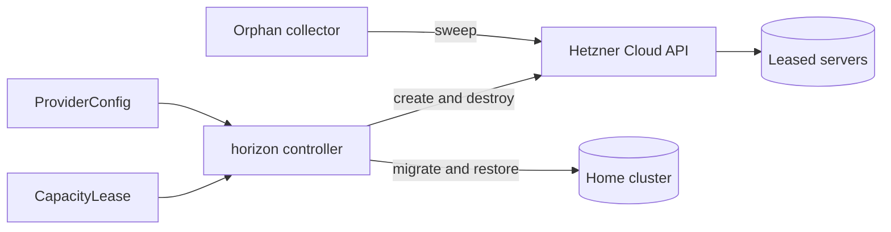

# horizon

[](https://github.com/lucawalz/horizon/actions/workflows/ci.yaml)
[](https://github.com/lucawalz/horizon/releases)
[](LICENSE)


Leases on-demand cloud capacity for a Kubernetes cluster and guarantees the capacity is destroyed when the lease expires.

## Description

horizon is a Kubernetes operator. It adds temporary worker capacity to a cluster that already exists, holds it for a bounded period, and takes it away again. A `CapacityLease` states how much capacity, from which provider and region, for how long, and for which workload. The controller provisions against that statement, moves the named workload onto the new nodes, and releases everything once the deadline passes.

Renting capacity is easy. Guaranteeing it goes away is the engineering problem, and that is what the project exists to solve. The value on offer is the promise that nothing is still billing after the deadline, not the provisioning.

The cluster horizon operates over lives in the companion [bedrock](https://github.com/lucawalz/bedrock) repository: three bare-metal nodes running NixOS and K3s, reconciled by Flux v2, with Tailscale carrying connectivity for nodes that are not on the home network. bedrock defines the cluster; horizon adds and removes temporary capacity on top of it. horizon is optional and never load-bearing: routine operation happens without it and the cluster keeps running when it is gone.

## Status

The chart and the image are published at `ghcr.io/lucawalz/charts/horizon` and `ghcr.io/lucawalz/horizon`, one version per release tag, and the badge above names the latest. `charts/horizon/Chart.yaml` declares the version the next tag will publish, so a checkout is ahead of both registries while a release is being prepared.

Implemented: the `CapacityLease` and `ProviderConfig` definitions; the lease controller and its layered teardown guarantee, below; workload migration and node drain; the Hetzner provider behind a conformance-tested seam; image selection by id, name, or label; cloud-init generation; the Helm chart; the single-page web interface served locally by `horizon dashboard`, which creates and releases leases as well as reading them; the in-cluster mode of the same interface, served by `horizon serve` behind a verified OIDC token and Kubernetes impersonation, templated by the chart behind `ui.enabled` and off by default; six commands, `horizon controller`, `horizon dashboard`, `horizon serve`, `horizon watchdog`, `horizon cloud-init`, `horizon version`.

Not implemented: provider credential writing from the interface, which is the half of its mutating surface that stays unbuilt now that lease creation and release have landed; the `watch` command and lease verbs, `kubectl get capacityleases` covers this with printer columns; `ProviderConfig` status conditions, the subresource exists and stays empty.

## How teardown is enforced

Teardown is layered, so no single failure leaves a machine running and billing.

A finalizer blocks lease deletion until the provider confirms the instance gone, not merely reports a successful delete call. Ownership and deadline labels are written in the same call that creates the instance, so nothing horizon creates is ever unlabelled or unaccounted for. An orphan collector sweeps every configured provider on a timer and reclaims what no live lease claims; a matching reconciler does the same for stranded `Node` objects. Launch and registration are each bounded by their own deadline, past which a stuck instance is released rather than left waiting. A lease is refused before acceptance if neither the provider nor its configuration can guarantee teardown, and the schema itself bounds `replicas`, `duration`, and `teardownGrace`.

The last layer runs on the leased server itself: `horizon watchdog`, a dead man's switch on two independent clocks, a monotonic backstop and a renewable wall-clock deadline pulled from the cluster, so the guarantee survives the operator, the cluster, and the network all being gone at once.

See [ADR 0017](docs/adr/0017-capacity-lease-controller-over-cli-saga.md) for the crash-safety layers and their exact parameters, [ADR 0018](docs/adr/0018-provider-seam-around-instance-lifecycle.md) for the provider seam and the label set, and [ADR 0021](docs/adr/0021-node-side-dead-mans-switch-on-two-clocks.md) for the watchdog's two clocks.

## Custom resources

Both definitions are cluster-scoped and live in the `horizon.dev/v1alpha1` group. `kubectl explain capacitylease.spec` and `kubectl explain providerconfig.spec.hetzner`, or the generated definitions in `config/crd/bases/`, carry the exhaustive field list; the two examples below carry only the fields an adopter sets in practice.

### CapacityLease

`spec.providerRef`, `spec.region`, `spec.replicas`, and `spec.duration` are required, together with exactly one of `spec.size` or `spec.requirements`. `spec.size` pins an instance type by name. `spec.requirements` states a minimum core count, an optional memory floor, an architecture, an optional CPU type and a selection strategy, and horizon resolves the cheapest offered type that satisfies them. `spec.providerRef`, `spec.region` and whichever of the two sizing fields is set are immutable, so a lease cannot be repointed once it holds capacity. `spec.workload.namespace` names the namespace to migrate onto the leased nodes and omitting it adds bare capacity. Status carries `phase` (`Pending`, `Provisioning`, `Active`, `Expiring`, `Released`, or `Degraded`), the resolved `instanceType`, the per-instance provider id, node name and join stage, and conditions. A lease sized from `spec.requirements` also carries `status.selection`, which records the strategy that ran, the chosen type with its hourly rate and currency, the runner-up it beat, how many types the catalogue `offered` and how many of them `qualified`, and a tally of the rejected candidates by the filter that rejected them. The stanza is written once, alongside `status.instanceType`, and is not rewritten as the catalogue moves. A lease that pins `spec.size` makes no policy decision and carries no stanza. Printer columns expose replicas, region, phase, expiry, readiness, whether the node-side watchdog is armed, age, and the resolved instance type, in that order, and `kubectl get -o wide` adds the instants the lease became ready and was released. `kubectl get`, k9s, Rancher and Headlamp are therefore all useful without a horizon-specific client; the short name is `cl`.

```yaml
apiVersion: horizon.dev/v1alpha1
kind: CapacityLease
metadata:
  name: batch-run
spec:
  providerRef: hetzner
  region: nbg1
  size: cx22
  replicas: 2
  duration: 2h
  workload:
    namespace: batch
```

### ProviderConfig

`spec.type` is `hetzner`, the only accepted value. `spec.hetzner.credentialsSecretRef` and `spec.hetzner.cloudInitSecretRef` are required, along with exactly one of `spec.hetzner.image` (by `name`, `id`, or `selector`) or the deprecated `spec.hetzner.imageSelector`. `spec.hetzner.nodeCredentialSecretRef` is optional in the schema but required in practice: Hetzner cannot stop billing by self-terminating, so a lease is refused while it is unset. `spec.hetzner.joinTokenSecretRef` is likewise optional in the schema but required whenever the cloud-init behind `cloudInitSecretRef` uses `${HORIZON_JOIN_TOKEN}`, and every document the `k3s` flavour of `horizon cloud-init` renders does; the provider build fails, naming the field, if the sentinel is present and the reference is unset. `spec.watchdog` is required and cross-validates `renewInterval`, `slack`, and `maxLifetime` against each other.

```yaml
apiVersion: horizon.dev/v1alpha1
kind: ProviderConfig
metadata:
  name: hetzner
spec:
  type: hetzner
  hetzner:
    credentialsSecretRef:
      name: horizon-hetzner
      key: token
    cloudInitSecretRef:
      name: horizon-cloud-init
      key: cloud-init
    nodeCredentialSecretRef:
      name: horizon-hetzner-node
      key: token
    joinTokenSecretRef:
      name: horizon-join-token
      key: token
    image:
      name: ubuntu-24.04
  watchdog:
    renewInterval: 1m
    slack: 2m
    maxLifetime: 8h
```

## Node join contract

A burst node satisfies four requirements. horizon generates the first three; the fourth is the adopter's network, and horizon has no opinion about it.

1. **Join as an agent.** The server runs a Kubernetes agent pointed at the control plane, at the version `--kubernetes-version` names rather than whatever release is newest. That version has to match the control plane: a kubelet newer than the apiserver is outside the Kubernetes version skew policy, so a node that installs the latest release against an older control plane is unsupported the moment it joins. `horizon cloud-init` renders this; see [Usage](#usage). An image that already ships the agent takes `--install-kubernetes=false`, which drops the install command and keeps the join configuration. Rendering pins nothing that was rendered earlier: the provider reads the blob behind `cloudInitSecretRef` and never regenerates it, so a Secret written before the version was pinned still installs whatever release is newest, on every node it boots, until it is re-rendered and applied over the old one. Upgrading the control plane is the other half of the same rule, and needs the same re-render.
2. **Carry `horizon.dev/pool=reserved` and the burst taint.** The provider build rejects a cloud-init missing the pool label, before any instance is created. The taint, `horizon.dev/burst=<lease>:NoSchedule`, is applied by the controller once it matches the node to its lease, since its value is the lease name and one cloud-init blob serves every lease a `ProviderConfig` provisions.
3. **Install and arm the watchdog.** `horizon cloud-init` writes the node token and a systemd unit that starts `horizon watchdog` on boot, unless `--install-watchdog-unit=false`. An image whose `/etc/systemd/system` is read-only, a NixOS image among them, takes `--transient-watchdog-unit` instead, which writes the unit to `/run/systemd/system` from a per-boot script and starts it rather than enabling it.
4. **Reach the control plane.** horizon has no VPN, no firewall management, and no opinion about how a leased server reaches the cluster beyond the `--server` URL it is given; getting a packet from Hetzner's network to the control plane is the adopter's problem, the same way it is bedrock's Tailscale for the nodes it runs permanently. Where that path is a VPN, the agent also has to be told to run its pod network over the tunnel, which is `--flavor-config flannel-iface=<interface>` for k3s.

Four sentinels are substituted when the provider builds the cloud-init: `${HORIZON_NODE_TOKEN}` and `${HORIZON_JOIN_TOKEN}` from their Secret references, `${HORIZON_VERSION}` from the controller's build stamp, `${HORIZON_MAX_LIFETIME}` from `spec.watchdog.maxLifetime`. Substitution is literal text replacement; anything else starting `${HORIZON_` left standing afterward fails the provider build rather than boot with a placeholder where a credential belongs.

## Configuration

Configuration is the `ProviderConfig` resource plus the Secrets it points at. There is no configuration file, and the binary reads none.

Secret references are resolved in the namespace the controller runs in, taken from the `POD_NAMESPACE` environment variable and falling back to the service account namespace file projected into the pod. A `ProviderConfig` is cluster-scoped, so the reference carries a name and a key but no namespace.

## Capacity model

Reserved capacity is the only path. An instance is operator-pinned: horizon creates it on demand against the Hetzner Cloud API and deletes it when the lease ends. See [Node join contract](#node-join-contract) for how a node identifies itself once it joins.

When a lease names a workload namespace, horizon rewrites the affinity of each Deployment and StatefulSet in it to target the reserved pool and adds the matching toleration, then restores the original placement during teardown.


```mermaid
flowchart LR
  lease[CapacityLease] --> controller[horizon controller]
  config[ProviderConfig] --> controller
  controller -->|create and destroy| hcloud[Hetzner Cloud API]
  hcloud --> servers[(Leased servers)]
  controller -->|migrate and restore| cluster[(Home cluster)]
  orphan[Orphan collector] -->|sweep| hcloud
```

## Architecture

The controller is built on controller-runtime. The provider is a seam rather than a dependency, so the reconcilers never reach a cloud SDK directly; see [ADR 0018](docs/adr/0018-provider-seam-around-instance-lifecycle.md). [Repository layout](#repository-layout) below maps each package to what it owns.

## Requirements

Hard requirements:

- A Kubernetes cluster at 1.29 or newer, and permission to install cluster-scoped custom resource definitions and RBAC into it.
- A Hetzner Cloud API token and a cloud-init that joins the cluster and applies the `horizon.dev/pool=reserved` node label, each stored in a Secret in the controller's namespace. `horizon cloud-init` generates the second; see [Usage](#usage).
- A delete-capable Hetzner Cloud API token for the leased machines, stored in a Secret in the controller's namespace and named by `nodeCredentialSecretRef`. Hetzner cannot stop billing by self-terminating, so no lease is accepted while that reference is unset.
- A k3s join token, stored in a Secret in the controller's namespace and named by `joinTokenSecretRef`. Every cloud-init `horizon cloud-init` generates needs it, and the provider build fails before any instance is created while the reference is unset.
- A boot image in the Hetzner project, selected by exact id, exact name, or one or more labels.

## Installation

The controller is installed from the Helm chart, published as an OCI artifact by a release tag:

```
helm install horizon oci://ghcr.io/lucawalz/charts/horizon \
  --namespace horizon-system --create-namespace
```

That resolves against the latest published chart. A checkout installs the working tree instead, which is ahead of the published chart while a release is being prepared:

```
helm install horizon ./charts/horizon --namespace horizon-system --create-namespace
```

The chart templates the controller Deployment, its ServiceAccount, a ClusterRole and binding for the cluster-scoped work, a namespaced Role and binding for leader election and Secret reads, a Service, and the two custom resource definitions. See [`charts/horizon/README.md`](charts/horizon/README.md) for every value and for why the definitions live in `crds/` rather than `templates/`.

Building from source needs Go 1.26 or newer:

```
make build
```

`make install` builds and installs the binary into `~/.local/bin`, re-signing it on macOS. Override the destination with `PREFIX`, and remove it with `make uninstall`. The binary is the controller, so it is only useful where it can reach a cluster.

## Usage

### Quick start

Nothing needs to exist beforehand except a Kubernetes cluster reachable with `kubectl` at 1.29 or newer, a Hetzner Cloud API token, and a boot image in the Hetzner project; a stock `ubuntu-24.04` image is enough, since horizon boots it with cloud-init rather than expecting anything horizon-specific baked in.

**1. Install the chart.** This installs from a checkout, which is ahead of the published chart:

```
helm install horizon ./charts/horizon --namespace horizon-system --create-namespace
```

**2. Create the Hetzner credential Secret**, in the controller's namespace:

```
kubectl create secret generic horizon-hetzner \
  --namespace horizon-system \
  --from-literal=token=<hetzner-api-token>
```

**3. Create a second Hetzner credential Secret for the node.** Hetzner Cloud API tokens are read-write per project rather than scoped to individual permissions, so the narrowing this token gets is organisational: mint a second token rather than reusing the one from step 2, so the node credential can be revoked on its own, without touching the operator's:

```
kubectl create secret generic horizon-hetzner-node \
  --namespace horizon-system \
  --from-literal=token=<hetzner-api-token-node>
```

**4. Create the join-token Secret**, holding the k3s token an agent presents to join the cluster. On the control plane, this is `/var/lib/rancher/k3s/server/node-token`:

```
kubectl create secret generic horizon-join-token \
  --namespace horizon-system \
  --from-literal=token=<k3s-join-token>
```

**5. Render the cloud-init**, naming the k3s release the node installs. It has to match the control plane, which reports its own as `v1.35.6+k3s1` on the server version line of `kubectl version`; a kubelet newer than the apiserver is outside the Kubernetes version skew policy, and an unpinned install would take whatever release is newest on the day the node boots:

```
horizon cloud-init --server https://<control-plane>:6443 \
  --kubernetes-version <k3s-release> > cloud-init.yaml
```

which prints (the two longer `runcmd` blocks are elided with `...` below; nothing else is):

```yaml
#cloud-config
write_files:
  - path: /etc/rancher/k3s/config.yaml
    permissions: '0600'
    owner: root:root
    content: |
      server: https://<control-plane>:6443
      token: ${HORIZON_JOIN_TOKEN}
      node-label:
        - horizon.dev/pool=reserved
  - path: /etc/horizon/token
    permissions: '0600'
    owner: root:root
    content: |
      ${HORIZON_NODE_TOKEN}
runcmd:
  - |
    curl -sfL https://get.k3s.io | INSTALL_K3S_VERSION=<k3s-release> sh -s - agent
  - |
    set -eu
    V=${HORIZON_VERSION}
    ...
    install -D -m0755 "$TMP/horizon" /var/lib/horizon/bin/horizon
  - |
    set -eu
    cat > /etc/systemd/system/horizon-watchdog.service <<'UNIT'
    ...
    ExecStart=/var/lib/horizon/bin/horizon watchdog --max-lifetime=${HORIZON_MAX_LIFETIME} --token-file=/etc/horizon/token --state-dir=/run/horizon
    ...
    systemctl enable --now horizon-watchdog.service
```

The two elided `runcmd` blocks download and checksum-verify the horizon binary at `${HORIZON_VERSION}`, then write and enable `horizon-watchdog.service`; the `${HORIZON_...}` placeholders are correct as printed, since they resolve when `ProviderConfig` builds the provider, not when the CLI renders the template.

A control plane that is only reachable over a VPN needs one more flag, `--flavor-config flannel-iface=<interface>`, naming the tunnel interface on the leased server. Without it the agent registers over the tunnel and then builds its pod network on the public interface, where it reaches nothing in the cluster. Two more flags cover images that are not stock: `--install-kubernetes=false` for an image that already ships k3s, and `--transient-watchdog-unit` for an image whose `/etc/systemd/system` is read-only. See [docs/cli-reference.md](docs/cli-reference.md).

**6. Create the cloud-init Secret from that file:**

```
kubectl create secret generic horizon-cloud-init \
  --namespace horizon-system \
  --from-file=cloud-init=cloud-init.yaml
```

**7. Apply a `ProviderConfig`** naming the image by name (a custom image works identically with `image: {selector: {...}}`):

```yaml
apiVersion: horizon.dev/v1alpha1
kind: ProviderConfig
metadata:
  name: hetzner
spec:
  type: hetzner
  hetzner:
    credentialsSecretRef: {name: horizon-hetzner, key: token}
    cloudInitSecretRef: {name: horizon-cloud-init, key: cloud-init}
    nodeCredentialSecretRef: {name: horizon-hetzner-node, key: token}
    joinTokenSecretRef: {name: horizon-join-token, key: token}
    image:
      name: ubuntu-24.04
  watchdog: {renewInterval: 1m, slack: 2m, maxLifetime: 8h}
```

**8. Apply a `CapacityLease` and watch the node register:**

```yaml
apiVersion: horizon.dev/v1alpha1
kind: CapacityLease
metadata:
  name: batch-run
spec:
  providerRef: hetzner
  region: nbg1
  size: cx22
  replicas: 1
  duration: 30m
```

```
kubectl apply -f capacitylease.yaml
kubectl get capacityleases -w
```

The chart install, the CLI render, and the manifest validation against a real API server, `image`, `nodeCredentialSecretRef`, and `joinTokenSecretRef` included, were confirmed while writing this document. Steps 3 and 4, the node credential and join-token Secrets, are the same `kubectl create secret generic` shape as step 2 and were not separately re-run with live tokens. Step 8 needs a Hetzner server to actually boot, and that step alone was not repeated for this document. It has been proven end to end before: a stock `ubuntu-24.04` node registered within 90 seconds of boot on 4 August, carrying `horizon.dev/pool=reserved` from its own cloud-init and `horizon.dev/burst=batch-run:NoSchedule` once the controller matched it to a lease named `batch-run`.

An unusual image is not a reason to leave the generator. A pre-baked image that already runs k3s, an immutable image that cannot take a unit in `/etc/systemd/system`, and a control plane reachable only over a VPN are each one flag: `--install-kubernetes=false`, `--transient-watchdog-unit`, and `--flavor-config flannel-iface=<interface>`. All three compose, and every one of them defaults to what the generator did before, so an existing rendered document is unchanged by their presence.

`horizon cloud-init --passthrough` is the remaining step past that, and it emits nothing horizon generates: no join configuration, no pool label, and no watchdog files or unit. It writes only the files and commands named on the command line, for an adopter who owns the whole cloud-init and wants horizon out of it, not for an adopter whose image merely differs from a stock one. The flags that feed the generated content, `--flavor`, `--server`, `--kubernetes-version`, `--label`, `--taint`, `--flavor-config`, `--install-kubernetes`, `--install-watchdog-unit`, `--transient-watchdog-unit`, and `--binary-base-url`, are rejected under `--passthrough` rather than silently discarded. The rendered document is still checked for the `horizon.dev/pool=reserved` node label the provider build requires, so a passthrough document has to carry that label itself. Passthrough also drops the watchdog, and with it the teardown guarantee, which is the reason to reach for a capability flag first.

### Web interface

`horizon dashboard` serves the web interface from the machine it runs on:

```
horizon dashboard
```

It reads the cluster with the caller's own kubeconfig credentials, which is the whole of its authentication, and it therefore binds to `127.0.0.1` and nothing else. The address is not a flag: only the port is, and the loopback address is built inside the server rather than accepted from a caller, so no invocation can widen it. Serving the same interface from inside the cluster is a separate mode and a separate command, `horizon serve`, described under [Serving the interface in a cluster](#serving-the-interface-in-a-cluster) below.

Four routes are served. The lease list carries the printer columns, one row per `CapacityLease`, with the time each lease has left counting down in its own column. The lease behind each row carries the reservation and the timeline, the conditions, the per-instance table and the workloads that were drained onto it. Its sizing reads the same whether the lease named an instance type or asked for a minimum core count, memory, architecture, CPU type and selection strategy, so a lease sized by requirements no longer shows an empty field. A lease sized by requirements also carries the selection panel, which names the strategy, the type it chose and its hourly rate, the runner-up, how many candidates were offered and how many qualified, and the tally of why the rest were rejected; a lease that named its own type states that absence rather than showing an empty panel. The new lease route is the create form, and the machines route lists the `ProviderConfig` resources in the cluster and the instance types a chosen one offers in a chosen region.

The countdown is the reason the interface exists, so it is the one reading that never waits on the network. Every deadline is rendered as a `<time>` element carrying the exact instant, and the browser advances the reading from that instant once a second. Nothing is refetched to make it tick, and a lease inside its last five minutes changes colour without asking the server anything. Polling is left with the one job the browser cannot do for itself, observing the phase changes the controller writes, and it runs every 20 seconds. A poll that fails leaves the last answer on screen rather than blanking a view that was reading fine.

The machine type catalogue answers with a named state rather than an empty table, and the interface carries wording for each one: nothing chosen yet, a catalogue this process does not hold, a provider config the refresher has not filled, a region that offers nothing, a read the provider refused, and the listing itself. The second is the ordinary answer for a local dashboard: instance types are fetched and cached by the controller inside the cluster, so a dashboard started outside it keeps no copy and says so.

The interface creates and releases leases, and does nothing else that writes: no provider config is edited, and no Secret is read or rendered. The create form asks for a requirement first, since that is what the controller resolves against the provider catalogue, and naming a machine type stays available as the escape hatch the custom resource already provides. A minimum memory carries its unit as a visible choice with the resolved byte count beside it, because `4Gi` is 4,294,967,296 bytes and a machine advertising 4 GB has 4,000,000,000, so the binary suffix silently excludes it. Bounds are shown while typing and enforced by CEL on the apiserver, whose refusal is forwarded with its own status code and message rather than restated. Releasing a lease deletes the `CapacityLease`, which is how the controller is asked for a teardown through its finalizer; the confirmation names the two clocks rather than asking whether the operator is sure, and nothing in the browser destroys a machine itself.

Writing is authorised by the caller's own kubeconfig, exactly as `kubectl` is, and it is guarded against the one thing loopback introduces. Any page in the same browser can reach `http://127.0.0.1:8973`, so a mutating request is first checked for the address it was sent to. Its `Host` must name the loopback address and the port the listener actually bound, which is read from the listener rather than from the request, because a name whose zone an attacker owns can be pointed at the loopback address and every other signal the browser then sends is genuine. Past that anchor, the request must also carry a custom header the interface sets on its own calls, `Sec-Fetch-Site: same-origin`, and an `Origin` matching the address it was addressed to where the browser sends one. Any failure answers `403`, and no CORS header is served by anything, because the absent `Access-Control-Allow-Origin` is what makes the preflight fail. A process built with no writer, which is what an embedder that supplies only a reader gets, answers both mutating routes with `501` and serves every read route unchanged. The reasoning is in [ADR 0027](docs/adr/0027-mutating-web-interface-behind-a-typed-writer-and-a-cross-origin-guard.md).

The interface is a single-page application, decided in [ADR 0025](docs/adr/0025-replace-server-rendered-interface-with-embedded-spa.md), which supersedes the server-rendered interface of [ADR 0019](docs/adr/0019-replace-terminal-interface-with-web-and-printer-columns.md). `internal/web/site` holds a Vite project in React and TypeScript styled with Tailwind, and `internal/web/api.go` serves the state behind the routes as JSON at `/api/leases`, `/api/leases/{name}` and `/api/machines`, with `POST /api/leases` and `DELETE /api/leases/{name}` behind the guard. The built bundle is committed at `internal/web/site/dist` and embedded with `//go:embed`, so `go build` still needs no JavaScript toolchain, and `go build -tags no_ui` produces the same operator with no interface in it. The rebuild changed how the interface is constructed and how much it can show; it did not change what it reads or how it authenticates.

### Serving the interface in a cluster

`horizon serve` serves the same interface on a routable address, for a team rather than for one operator at one terminal:

```
horizon serve --oidc-issuer=https://sso.example.com/application/o/horizon/ \
  --oidc-audience=horizon --external-origin=https://horizon.example.com
```

Every request has to carry a signed JWT in a configured header, `Authorization` by default. The token is verified against the key set discovered from the issuer's own `/.well-known/openid-configuration` document, which is why there is no separate key set setting: an issuer and a key set from two places would verify tokens minted by whoever owned the second one. Only asymmetric algorithms are accepted, by allowlist, because a symmetric signature makes the published key set a signing key. The command refuses to start unless the issuer, the audience, the header and both claim names are set, and unless the key set it discovers is reachable and holds at least one asymmetric key, so an endpoint that cannot identify its callers never reaches the point of binding.

Authorisation is Kubernetes impersonation of the username and groups the verified token names, so the cluster's own RBAC decides what a caller reaches and the interface grants nothing on its own. An identity with no rights over `capacityleases` receives the apiserver's refusal, and admitting an operator is a RoleBinding rather than a change to horizon. The cross-origin guard is anchored to `--external-origin` in this mode rather than to the loopback address, since behind a proxy the address the listener bound and the origin a browser reaches are two different things.

The chart templates the mode behind `ui.enabled` and the default is off. Enabled, it renders a second Deployment from the same image with its own ServiceAccount, whose only permission is `impersonate` on users and groups and which never holds the controller's, alongside a Service and a NetworkPolicy admitting only named namespaces. It refuses to render when the mode is enabled without an issuer and an audience, and when the two ServiceAccount names collide. [docs/serving-the-interface.md](docs/serving-the-interface.md) covers the chart values, what an identity provider has to publish, a sample RBAC grant for an impersonated operator, and narrowing the impersonation permission with `resourceNames`. The reasoning is in [ADR 0028](docs/adr/0028-serve-the-interface-in-cluster-behind-a-verified-token-and-impersonation.md).

### Command line reference

Six commands, and `horizon` with no subcommand prints help:

```
horizon controller   Run the in-cluster capacity lease controller
horizon dashboard    Serve the web interface on loopback
horizon serve        Serve the web interface on a routable address behind an OIDC issuer
horizon watchdog     Enforce the node-side teardown deadline from the leased server itself
horizon cloud-init   Render the cloud-init a burst node needs to join a cluster
horizon version      Print the build version
```

Every flag, with its default and what it is for, is in [docs/cli-reference.md](docs/cli-reference.md).

## Releases

`charts/horizon/Chart.yaml` is the source of truth for the released version; bumping it is a deliberate commit that precedes the tag. Pushing a `v*` tag builds the linux amd64 and arm64 image, packages the chart, and only then publishes the GitHub release, in that order, so a published release always advertises an image and a chart that exist. See [ADR 0020](docs/adr/0020-chart-yaml-as-the-release-version-source-of-truth.md) for the full contract.

The image is distroless and runs as uid 65532. The archive binaries and the image binary are built with `-trimpath` and identical linker flags, so the two are byte-identical for a given platform.

## Repository layout

```
api/v1alpha1/       CapacityLease and ProviderConfig types
cmd/horizon/        main entry point
internal/cli/       cobra root, version, controller, dashboard, serve, watchdog, and cloud-init commands
internal/agent/     node-side dead man's switch
internal/manager/   controller-runtime wiring
internal/web/       web interface, json endpoints and the embedded bundle
                    site/ vite, react and typescript project, dist/ committed
internal/oidc/      bearer token verification against the issuer's published key set
internal/controller/  lease reconciler, orphan collector, provider factory
internal/k8s/       workload migration, placement restore, node drain
internal/cloudinit/ cloud-init join document generator, one file per flavour
internal/provider/  instance lifecycle interface, capabilities, label constants
                    hetzner/ Hetzner Cloud implementation
                    conformance/ contract suite every implementation must pass
                    fake/ in-memory implementation with a create and delete ledger
internal/version/   build stamp
config/crd/bases/   generated custom resource definitions
charts/horizon/     Helm chart for the in-cluster controller and the optional interface
docs/               evaluation report, and the guide to serving the interface in a cluster
docs/adr/           architecture decision records
```

## Contributing

Contributions are welcome. See [CONTRIBUTING.md](CONTRIBUTING.md) for the build, test, branch, and commit conventions. In short: `go build ./...`, `make test`, which fetches the envtest control plane binaries the controller tests need, and `golangci-lint run`, then open a PR against `main`; CI runs the same checks.

## Security

See [SECURITY.md](SECURITY.md) for the supported versions and how to report a vulnerability.

## Support

Open an issue on the [GitHub repository](https://github.com/lucawalz/horizon/issues).

## Authors and acknowledgment

Built and maintained by Luca Walz. It builds on cobra, controller-runtime, client-go, the kubectl drain libraries, and the Hetzner Cloud SDK.

## License

Released under the MIT License. See [LICENSE](LICENSE).

## Project status

Actively developed alongside the bedrock homelab.
